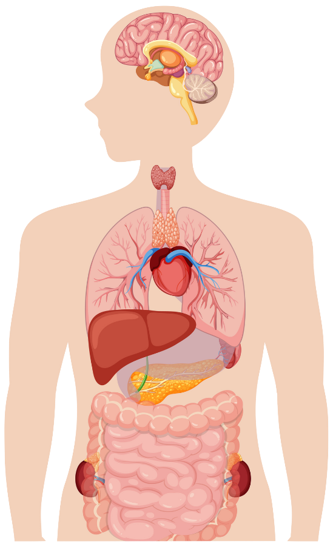
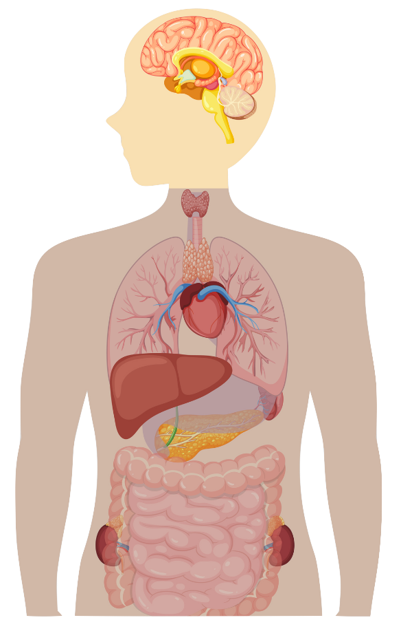
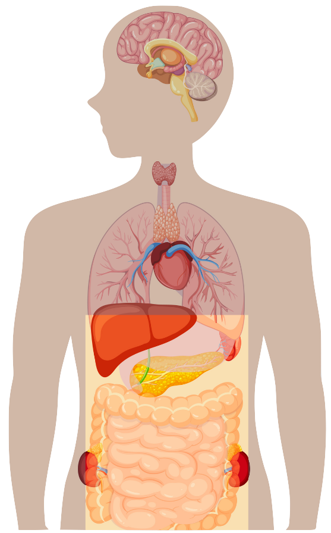
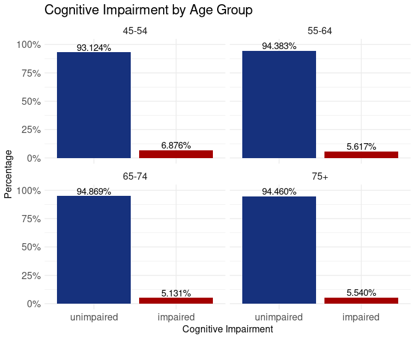
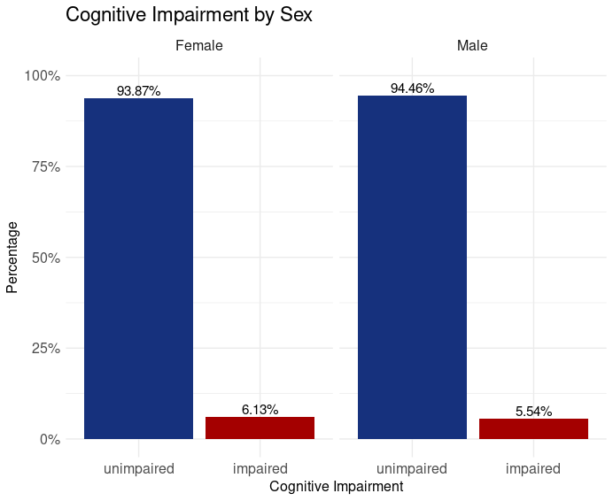
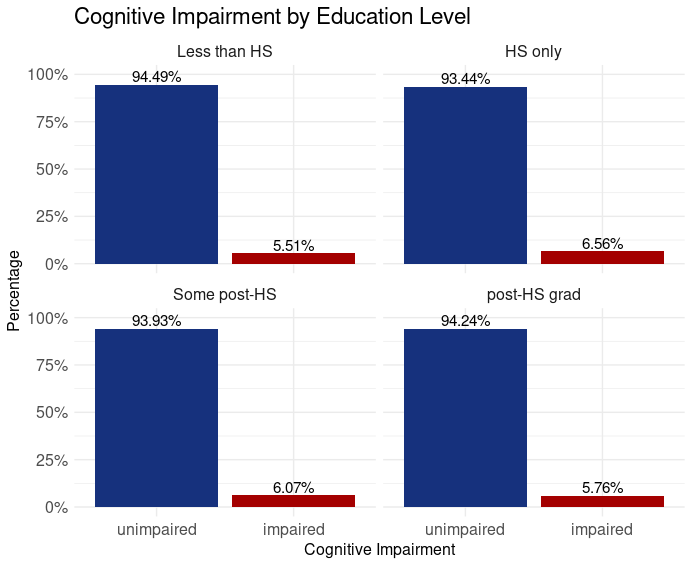
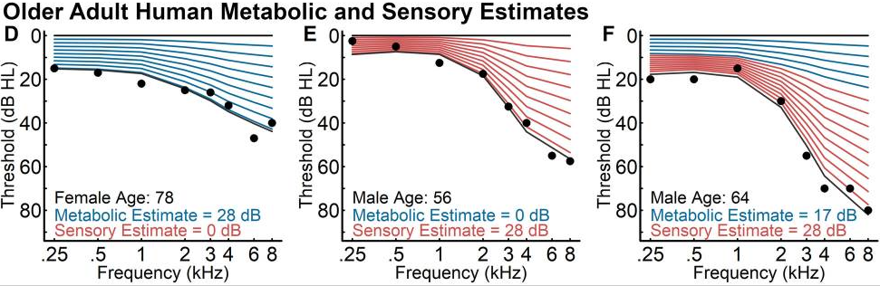

## Dementia {data-name="Background" auto-animate="true"}
### A Common Neurodegenerative Disorder {style="color: gray;"}

::: {.fragment fragment-index='1' .fade-in}
Symptoms
:::

::: {.fragment fragment-index='3' .fade-in}
Demographics
:::


::: {data-id="brain" .fragment fragment-index='1' .slide-in-from-top style="position: absolute; top: 250px; left: 650px; width: 275px; height: auto;"}

:::


::: {.fragment fragment-index='1' .slide-in-from-bottom-then-top style="position: absolute; left: 975px; top: 275px; width: 200px; height: auto;"}
{data-id="cog1"}
:::

::: {.fragment fragment-index='1' .slide-in-from-bottom-then-top style="position: absolute; left: 400px; top: 275px; width: 200px; height: auto;"}
{data-id="cog2"}
:::

::: {.fragment fragment-index='1' .slide-in-from-bottom-then-top style="position: absolute; left: 525px; top: 50px; width: 200px; height: auto;"}
{data-id="cog3"}
:::

::: {.fragment fragment-index='1' .slide-in-from-bottom-then-top style="position: absolute; left: 825px; top: 50px; width: 200px; height: auto;"}
{data-id="cog4"}
:::

::: {.fragment fragment-index='2' .slide-in-from-bottom-then-top style="position: absolute; left: 975px; top: 275px; width: 200px; height: auto;"}
{data-id="psych1"}
:::

::: {.fragment fragment-index='2' .slide-in-from-bottom-then-top style="position: absolute; left: 400px; top: 275px; width: 200px; height: auto;"}
{data-id="psych2"}
:::

::: {.fragment fragment-index='2' .slide-in-from-bottom-then-top style="position: absolute; left: 525px; top: 50px; width: 200px; height: auto;"}
{data-id="psych3"}
:::

::: {.fragment fragment-index='2' .slide-in-from-bottom-then-top style="position: absolute; left: 825px; top: 50px; width: 200px; height: auto;"}
{data-id="psych4"}
:::

::: {.fragment fragment-index='3' .fade-in style="position: absolute; left: 935px; top: 125px; width: 265px; height: auto;"}
{auto-animate-id="demogr1"}
:::

::: {.fragment fragment-index='3' .fade-in style="position: absolute; left: 325px; top: 125px; width: 350px; height: auto;"}
{auto-animate-id="demogr2"}
:::

::: {.fragment fragment-index='3' .fade-in style="position: absolute; left: 665px; top: 0px; width: 250px; height: auto;"}
{auto-animate-id="demogr3"}
:::

::: {data-id="subtype1" style="position: absolute; left: 300px; top: -4000px; width: 950px; height: auto;"}

:::

::: {data-id="subtype2" style="position: absolute; left: 300px; top: 6000px; width: 950px; height: auto;"}

:::

## Dementia {auto-animate="true"}
### A Common Neurodegenerative Disorder {style="color: gray;"}

::: {style="opacity: 50%;"}
Symptoms

Demographics
:::

Subtypes


::: {data-id="subtype1" style="position: absolute; left: 300px; top: 0px; width: 950px; height: auto;"}

:::

::: {data-id="subtype2" style="position: absolute; left: 300px; top: 0px; width: 950px; height: auto;"}

:::

## Dementia {auto-animate="true"}
### A Common Neurodegenerative Disorder {style="color: gray;"}

::: {style="opacity: 50%;"}
Symptoms

Demographics

Subtypes
:::

Causes


::: {.dementia-text-box style="text-align: center; background: #385E9D; color: white; position: absolute; top: 50px; left: 550px; width: 450px; padding: 0.1em;"}

PROTEIN AGGREGATES

(tau, amyloids, others)

:::

::: {.fragment .fade-in-then-out fragment-index=1 data-id="amyloid-salahuddin" style="position: absolute; left: 400px; top: 200px; width: 950px; height: auto;"}

:::

::: {.fragment .fade-in fragment-index=2 .dementia-text-box style="text-align: center;  background: #385E9D; color: white; position: absolute; top: 205px; left: 550px; width: 450px; padding: 0.1em;"}

LOSS OF NEURONS and SYNAPSE CONNECTIONS
:::

::: {.fragment .fade-in fragment-index=3 .dementia-text-box style="text-align: center; background: #385E9D; color: white; position: absolute; top: 350px; left: 550px; width: 450px; padding: 0.1em;"}

CHRONIC INFLAMMATION
:::

::: {.fragment .fade-in fragment-index=4 .dementia-text-box style="text-align: center; background: #385E9D; color: white; position: absolute; top: 445px; left: 550px; width: 450px; padding: 0.1em;"}

VASCULAR DAMAGE
:::


## Dementia {auto-animate="true"}
### A Common Neurodegenerative Disorder {style="color: gray;"}

::: {style="opacity: 50%;"}
Symptoms

Demographics

Subtypes

Causes
:::

Regions


::: {.fragment .fade-in-then-semi-out fragment-index=1 style="text-align: center; position: absolute; top: 15px; left: 675px; width: 350px; font-size: 20pt;"}
**TEMPORAL LOBE**

(learning and memory)
:::

::: {.fragment .fade-in-then-semi-out fragment-index=2 style="text-align: center; position: absolute; top: 115px; left: 675px; width: 350px; font-size: 20pt;"}
**CEREBRAL CORTEX**

(intelligence, behaviour, language, etc.)
:::

::: {.fragment .fade-in-then-semi-out fragment-index=3 style="text-align: center; position: absolute; top: 250px; left: 775px; width: 350px; font-size: 20pt;"}
**OTHER BRAIN REGIONS**

(brain shrinking, decreased neurogenesis)
:::

::: {.fragment .fade-in fragment-index=4 style="text-align: center; position: absolute; top: 400px; left: 775px; width: 350px; font-size: 20pt;"}
**OTHER AREAS OF BODY**

(gut lining, CNS, PNS)
:::

::: {.fragment .fade-out fragment-index=1 style="position: absolute; top: 0px; left: 450px; width: 350px;"}

:::

::: {.fragment .fade-in fragment-index=1 style="position: absolute; top: 0px; left: 450px; width: 350px;"}
::: {.fragment .fade-out fragment-index=4}

:::
:::

::: {.fragment .fade-in-then-out fragment-index=4 style="position: absolute; top: 0px; left: 450px; width: 350px;"}

:::


## Dementia {transition="fade" transition-speed="fast" .scrollable}
### Global Risk Factors: [Lancet Report 2024](https://www.thelancet.com/journals/lancet/article/PIIS0140-6736(24)01296-0/fulltext){target="_blank"}


:::: {style="position: absolute; left: 200px; top: 100px; width: 750px; height: auto;"}


::: {data-id="4em-space" style="display:inline-block; height:4em;"}
:::

::::


## Dementia {transition="fade" transition-speed="fast" .scrollable}
### **Canada** Risk Factors: [Son 2024](https://www.sciencedirect.com/science/article/pii/S2274580724006800?via%3Dihub){target="_blank"}


:::: {style="position: absolute; left: 150px; top: 100px; width: 850px; height: auto;"}


::: {data-id="4em-space" style="display:inline-block; height:4em;"}
:::

::::


## Age-Related Hearing Loss (ARHL) {auto-animate="true"}
### A Common Sensory Impairment {style="color: gray;"}

::: {.fragment fragment-index='1' .fade-in-then-semi-out}
Symptoms
:::

::: {.fragment fragment-index='2' .fade-in-then-semi-out}
Demographics
:::

::: {.fragment fragment-index='3' .fade-in}
Potential Causes
:::

::: {.fragment .fade-in-then-out fragment-index=1 style="position: absolute; top: 50px; left: 450px; width: 525px;"}

:::

::: {.fragment fragment-index='2' .fade-in-then-out style="position: absolute; left: 150px; top: 215px; width: 325px; height: auto;"}
{auto-animate-id="ear1"}
:::

::: {.fragment fragment-index='2' .fade-in-then-out style="position: absolute; left: 475px; top: 220px; width: 275px; height: auto;"}
{auto-animate-id="ear2"}
:::

::: {.fragment fragment-index='2' .fade-in-then-out style="position: absolute; left: 750px; top: 215px; width: 425px; height: auto;"}
{auto-animate-id="ear3"}
:::


::: {.fragment .fade-in fragment-index=3 .dementia-text-box style="text-align: center; background: var(--lab-yellow); color: white; position: absolute; top: 85px; left: 550px; width: 500px; padding: 0.1em;"}
ENVIRONMENTAL FACTORS

(noise, drug toxicity)
:::


::: {.fragment .fade-in fragment-index=4 .dementia-text-box style="text-align: center;  background: var(--lab-yellow); color: white; position: absolute; top: 245px; left: 550px; width: 500px; padding: 0.1em;"}
OXIDATIVE STRESS
:::

::: {.fragment .fade-in fragment-index=5 .dementia-text-box style="text-align: center; background: var(--lab-yellow); color: white; position: absolute; top: 345px; left: 550px; width: 500px; padding: 0.1em;"}
CHRONIC INFLAMMATION
:::

::: {.fragment .fade-in fragment-index=6 .dementia-text-box style="text-align: center; background: var(--lab-yellow); color: white; position: absolute; top: 445px; left: 550px; width: 500px; padding: 0.1em;"}
GENETICS
:::


## ARHL and Dementia
### Hypotheses {style="color: gray;"}

::: {.incremental}
- **Sensory Deprivation**: Poor hearing leads to high cognitive load
- **Social Isolation**: Depression from poor social interactions and low auditory input
- **Mediating Pathology**: External mechanism acting on auditory pathway *and* brain
- **Causal Relationship**: ARHL causes Dementia
:::

## ARHL and Dementia [Genetic Studies]{style="font-size: 20pt; color: gray; text-align: right;"}

:::: {.fragment fragment-index=1 .fade-out style="position: absolute; top: 75px; left: 0px;"}
````{=html}
<style type="text/css">
.tg  {border-collapse:collapse;border-spacing:0;}
.tg td{border-color:black;border-style:solid;border-width:1px;font-family:Arial, sans-serif;font-size:14px;
  overflow:hidden;padding:10px 5px;word-break:normal;}
.tg th{border-color:black;border-style:solid;border-width:1px;font-family:Arial, sans-serif;font-size:14px;
  font-weight:normal;overflow:hidden;padding:10px 5px;word-break:normal;}
.tg .tg-0pky{border-color:inherit;text-align:left;vertical-align:top}
</style>
<table class="tg"><thead>
  <tr>
    <th class="tg-0pky">Paper</th>
    <th class="tg-0pky">Study Design</th>
    <th class="tg-0pky">n</th>
    <th class="tg-0pky">Pop.</th>
    <th class="tg-0pky">Hearing Loss Phenotype</th>
    <th class="tg-0pky">Cog. Phenotype</th>
    <th class="tg-0pky">Finding</th>
  </tr></thead>
<tbody>
  <tr>
    <td class="tg-0pky">Mitchell 2020</td>
    <td class="tg-0pky">GWAS-PW, MR, PGS</td>
    <td class="tg-0pky">250k</td>
    <td class="tg-0pky">European</td>
    <td class="tg-0pky">Self-reported Hearing Difficulty</td>
    <td class="tg-0pky">Clinical Diagnosis, 'AD-by-Proxy'</td>
    <td class="tg-0pky">No Causal Effect, AD PGS predicts H. Diff.</td>
  </tr>
  <tr>
    <td class="tg-0pky">Brenowitz 2020</td>
    <td class="tg-0pky">MR, PGS</td>
    <td class="tg-0pky">245k</td>
    <td class="tg-0pky">European</td>
    <td class="tg-0pky">Digital Triplet Test, <br>Self-report</td>
    <td class="tg-0pky">Verbal Reasoning test score, <br>AD PGS (based on 25 genetic loci)</td>
    <td class="tg-0pky">Association between AD PGS and <br>poor speech-in-noise hearing,<br>No Association between Hearing PGS <br>and cognitive scores.</td>
  </tr>
  <tr>
    <td class="tg-0pky">Xu 2024</td>
    <td class="tg-0pky">MR, Cross-sectional <br>Study</td>
    <td class="tg-0pky">500k (Eur.)<br>363 (Chin.)</td>
    <td class="tg-0pky">European<br>and Chinese</td>
    <td class="tg-0pky">Self-report, Audiometry</td>
    <td class="tg-0pky">Battery of Cognitive Tests</td>
    <td class="tg-0pky">Hearing Loss is a risk factor for <br>cognitive impairment</td>
  </tr>
  <tr>
    <td class="tg-0pky">Wang 2022</td>
    <td class="tg-0pky">PGS, cross-sectional <br>and longitudinal analysis</td>
    <td class="tg-0pky">500k (Eur.)<br></td>
    <td class="tg-0pky">European <br>and Chinese</td>
    <td class="tg-0pky">Self-report, Speech-in-Noise Test</td>
    <td class="tg-0pky">Battery of Cognitive Tests, <br>Imaging Data, CSF Protein levels <br>(tau, amyloid-beta)</td>
    <td class="tg-0pky">Hearing Impairment is associated with <br>cognitive decline, brain atrophy, <br>and tau levels</td>
  </tr>
  <tr>
    <td class="tg-0pky">Abidin 2021</td>
    <td class="tg-0pky">MR, Gene-set and <br>function enrichment</td>
    <td class="tg-0pky">250k</td>
    <td class="tg-0pky">European</td>
    <td class="tg-0pky">Self-report</td>
    <td class="tg-0pky">Clinical Diagnosis</td>
    <td class="tg-0pky">No Genetic Correlation, Possible causal<br>relationship from AD to HL via APOE locus</td>
  </tr>
  <!-- made here: https://www.tablesgenerator.com/html_tables -->
</tbody></table>


````
::::

:::: {.fragment fragment-index=1 .fade-in-then-out style="position: absolute; top: 75px; left: 0px;"}
````{=html}

<!-- colored in "Finding" cells -->

<style type="text/css">
.tg  {border-collapse:collapse;border-spacing:0;}
.tg td{border-color:black;border-style:solid;border-width:1px;font-family:Arial, sans-serif;font-size:14px;
  overflow:hidden;padding:10px 5px;word-break:normal;}
.tg th{border-color:black;border-style:solid;border-width:1px;font-family:Arial, sans-serif;font-size:14px;
  font-weight:normal;overflow:hidden;padding:10px 5px;word-break:normal;}
.tg .tg-0pky{border-color:inherit;text-align:left;vertical-align:top}
</style>
<table class="tg"><thead>
  <tr>
    <th class="tg-0pky">Paper</th>
    <th class="tg-0pky">Study Design</th>
    <th class="tg-0pky">Sample Size</th>
    <th class="tg-0pky">Population</th>
    <th class="tg-0pky">Hearing Loss Phenotype</th>
    <th class="tg-0pky">Cog. Phenotype</th>
    <th class="tg-0pky">Finding</th>
  </tr></thead>
<tbody>
  <tr>
    <td class="tg-0pky">Mitchell 2020</td>
    <td class="tg-0pky">GWAS-PW, MR, PGS</td>
    <td class="tg-0pky">250k</td>
    <td class="tg-0pky">European</td>
    <td class="tg-0pky">Self-reported Hearing Difficulty</td>
    <td class="tg-0pky">Clinical Diagnosis, 'AD-by-Proxy'</td>
    <td class="tg-0pky" style="background: #ffffa0;">No Causal Effect, AD PGS predicts H. Diff.</td>
  </tr>
  <tr>
    <td class="tg-0pky">Brenowitz 2020</td>
    <td class="tg-0pky">MR, PGS</td>
    <td class="tg-0pky">245k</td>
    <td class="tg-0pky">European</td>
    <td class="tg-0pky">Digital Triplet Test, <br>Self-report</td>
    <td class="tg-0pky">Verbal Reasoning test score, <br>AD PGS (based on 25 genetic loci)</td>
    <td class="tg-0pky" style="background: #ffffa0;">Association between AD PGS and <br>poor speech-in-noise hearing,<br>No Association between Hearing PGS <br>and cognitive scores.</td>
  </tr>
  <tr>
    <td class="tg-0pky">Xu 2024</td>
    <td class="tg-0pky">MR, Cross-sectional <br>Study</td>
    <td class="tg-0pky">500k (Eur.)<br>363 (Chin.)</td>
    <td class="tg-0pky">European<br>and Chinese</td>
    <td class="tg-0pky">Self-report, Audiometry</td>
    <td class="tg-0pky">Battery of Cognitive Tests</td>
    <td class="tg-0pky" style="background: #c3f78c;">Hearing Loss is a risk factor for <br>cognitive impairment</td>
  </tr>
  <tr>
    <td class="tg-0pky">Wang 2022</td>
    <td class="tg-0pky">PGS, cross-sectional <br>and longitudinal analysis</td>
    <td class="tg-0pky">500k (Eur.)<br></td>
    <td class="tg-0pky">European <br>and Chinese</td>
    <td class="tg-0pky">Self-report, Speech-in-Noise Test</td>
    <td class="tg-0pky">Battery of Cognitive Tests, <br>Imaging Data, CSF Protein levels <br>(tau, amyloid-beta)</td>
    <td class="tg-0pky" style="background: #c3f78c;">Hearing Impairment is associated with <br>cognitive decline, brain atrophy, <br>and tau levels</td>
  </tr>
  <tr>
    <td class="tg-0pky">Abidin 2021</td>
    <td class="tg-0pky">MR, Gene-set and <br>function enrichment</td>
    <td class="tg-0pky">250k</td>
    <td class="tg-0pky">European</td>
    <td class="tg-0pky">Self-report</td>
    <td class="tg-0pky">Clinical Diagnosis</td>
    <td class="tg-0pky" style="background: #ff8282;">No Genetic Correlation, Possible causal<br>relationship from AD to HL via APOE locus</td>
  </tr>
  <!-- made here: https://www.tablesgenerator.com/html_tables -->
</tbody></table>


````
::::

:::: {.fragment fragment-index=2 .fade-in style="position: absolute; top: 75px; left: 0px;"}
````{=html}

<!-- Highlighting Phenotypes -->

<style type="text/css">
.tg  {border-collapse:collapse;border-spacing:0;}
.tg td{border-color:black;border-style:solid;border-width:1px;font-family:Arial, sans-serif;font-size:14px;
  overflow:hidden;padding:10px 5px;word-break:normal;}
.tg th{border-color:black;border-style:solid;border-width:1px;font-family:Arial, sans-serif;font-size:14px;
  font-weight:normal;overflow:hidden;padding:10px 5px;word-break:normal;}
.tg .tg-0pky{border-color:inherit;text-align:left;vertical-align:top}
</style>
<table class="tg"><thead>
  <tr>
    <th class="tg-0pky">Paper</th>
    <th class="tg-0pky">Study Design</th>
    <th class="tg-0pky">Sample Size</th>
    <th class="tg-0pky">Population</th>
    <th class="tg-0pky">Hearing Loss Phenotype</th>
    <th class="tg-0pky">Cog. Phenotype</th>
    <th class="tg-0pky">Finding</th>
  </tr></thead>
<tbody>
  <tr>
    <td class="tg-0pky">Mitchell 2020</td>
    <td class="tg-0pky">GWAS-PW, MR, PGS</td>
    <td class="tg-0pky">250k</td>
    <td class="tg-0pky">European</td>
    <td class="tg-0pky" style="background: #e5e4e0;">Self-reported Hearing Difficulty</td>
    <td class="tg-0pky" style="background: #e5e4e0;">Clinical Diagnosis, 'AD-by-Proxy'</td>
    <td class="tg-0pky" style="background: #ffffa0;">No Causal Effect, AD PGS predicts H. Diff.</td>
  </tr>
  <tr>
    <td class="tg-0pky">Brenowitz 2020</td>
    <td class="tg-0pky">MR, PGS</td>
    <td class="tg-0pky">245k</td>
    <td class="tg-0pky">European</td>
    <td class="tg-0pky" style="background: #e5e4e0;">Digital Triplet Test, <br>Self-report</td>
    <td class="tg-0pky" style="background: #e5e4e0;">Verbal Reasoning test score, <br>AD PGS (based on 25 genetic loci)</td>
    <td class="tg-0pky" style="background: #ffffa0;">Association between AD PGS and <br>poor speech-in-noise hearing,<br>No Association between Hearing PGS <br>and cognitive scores.</td>
  </tr>
  <tr>
    <td class="tg-0pky">Xu 2024</td>
    <td class="tg-0pky">MR, Cross-sectional <br>Study</td>
    <td class="tg-0pky">500k (Eur.)<br>363 (Chin.)</td>
    <td class="tg-0pky">European<br>and Chinese</td>
    <td class="tg-0pky" style="background: #e5e4e0;">Self-report, Audiometry</td>
    <td class="tg-0pky" style="background: #e5e4e0;">Battery of Cognitive Tests</td>
    <td class="tg-0pky" style="background: #c3f78c;">Hearing Loss is a risk factor for <br>cognitive impairment</td>
  </tr>
  <tr>
    <td class="tg-0pky">Wang 2022</td>
    <td class="tg-0pky">PGS, cross-sectional <br>and longitudinal analysis</td>
    <td class="tg-0pky">500k (Eur.)<br></td>
    <td class="tg-0pky">European <br>and Chinese</td>
    <td class="tg-0pky" style="background: #e5e4e0;">Self-report, Speech-in-Noise Test</td>
    <td class="tg-0pky" style="background: #e5e4e0;">Battery of Cognitive Tests, <br>Imaging Data, CSF Protein levels <br>(tau, amyloid-beta)</td>
    <td class="tg-0pky" style="background: #c3f78c;">Hearing Impairment is associated with <br>cognitive decline, brain atrophy, <br>and tau levels</td>
  </tr>
  <tr>
    <td class="tg-0pky">Abidin 2021</td>
    <td class="tg-0pky">MR, Gene-set and <br>function enrichment</td>
    <td class="tg-0pky">250k</td>
    <td class="tg-0pky">European</td>
    <td class="tg-0pky" style="background: #e5e4e0;">Self-report</td>
    <td class="tg-0pky" style="background: #e5e4e0;">Clinical Diagnosis</td>
    <td class="tg-0pky" style="background: #ff8282;">No Genetic Correlation, Possible causal<br>relationship from AD to HL via APOE locus</td>
  </tr>
  <!-- made here: https://www.tablesgenerator.com/html_tables -->
</tbody></table>


````
::::

## Project Overview {data-name="Overview" auto-animate="true"}

::: {.fragment .fade-in fragment-index=1 .overview-text-box style="color: white; background: #385E9D; position: absolute; top: 100px; left: 50px; width: 1000px;"}

[Hypothesis]{style="text-decoration: underline;"}

[Using clear hearing and cognitive phenotypes, we can better understand the genetic relationship between ARHL and dementia.]{style="font-size: 20pt;"}
:::

::: {.fragment .fade-in fragment-index=2 .overview-text-box data-id="aim1-box" style="text-align: center; background: gray; color: white; position: absolute; top: 300px; left: 50px; width: 450px; padding: 0.5em;"}

Aim 1: Underlying Genetics

::: {.fragment .fade-in fragment-index=3 style="font-size: 20pt;"}
- Causal Relationship (MR)
:::

::: {.fragment .fade-in fragment-index=4 style="font-size: 20pt;"}
- Correlated Genes (MTAG)
:::
:::

::: {.fragment .fade-in fragment-index=5 .overview-text-box data-id="aim2-box" style="text-align: center; background: gray; color: white; position: absolute; top: 300px; left: 560px; width: 450px; padding: 0.5em;"}

Aim 2: Prediction Model

::: {.fragment .fade-in fragment-index=6 style="font-size: 20pt;"}
- PGS robust to Ancestry Differences (SBayesRC)
:::

:::

## Project Overview {auto-animate="true"}

::: {.fragment fragment-index=1 .fade-out .overview-text-box style="color: white; background: #385E9D; position: absolute; top: 100px; left: 50px; width: 1000px;"}

[Hypothesis]{style="text-decoration: underline;"}

[Using clear hearing and cognitive phenotypes, we can better understand the genetic relationship between ARHL and dementia.]{style="font-size: 20pt;"}
:::

::: {.fragment fragment-index=1 .fade-in .overview-text-box style="color: white; background: #385E9D; position: absolute; top: 100px; left: 50px; width: 1000px;"}

[Hypothesis]{style="text-decoration: underline;"}

[Specifically, we hypothesize a Causal Relationship and Mediating Pathologies \n \s]{style="font-size: 20pt;"}
:::

::: {.overview-text-box data-id="aim1-box" style="text-align: center; background: var(--lab-yellow); color: white; position: absolute; top: 300px; left: 325px; width: 450px; padding: 0.5em; z-index: 1;"}

Aim 1: Underlying Genetics

::: {style="font-size: 20pt;"}
- Causal Relationship (MR)
:::

::: {style="font-size: 20pt;"}
- Correlated Genes (MTAG)
:::
:::

::: {.overview-text-box data-id="aim2-box" style="text-align: center; background: lightgray; opacity: 0.6; color: white; position: absolute; top: 300px; left: 760px; width: 450px; padding: 0.5em;"}

Aim 2: Prediction Model

::: {style="font-size: 20pt;"}
- PGS robust to Ancestry Differences (SBayesRC)
:::

:::

## CLSA {data-name="Data"}
### (Canadian Longitudinal Study on Aging) {style="color: gray;"}

::: {.fragment fragment-index=1 .fade-in-then-out style="position: absolute; left: 250px; top: 100px; width: 600px; height: auto;"}

:::

::: {.fragment fragment-index=2 .fade-in-then-out style="position: absolute; left: 250px; top: 100px; width: 600px; height: auto;"}

:::

::: {.fragment fragment-index=3 .fade-in-then-out style="position: absolute; left: 250px; top: 100px; width: 600px; height: auto;"}

:::

::: {.fragment fragment-index=3 .fade-in-then-out style="position: absolute; left: 850px; top: 200px; width: 600px; height: auto; color: red; font-size: 20pt;"}
Comprehensive Cohort
:::

::: {.fragment fragment-index=4 .fade-in style="position: absolute; left: 250px; top: 100px; width: 600px; height: auto;"}

:::

::: {.fragment fragment-index=5 .fade-in style="position: absolute; left: 250px; top: 100px; width: 600px; height: auto;"}

:::

::: {.fragment fragment-index=5 .fade-in style="position: absolute; left: 45px; top: 350px; width: 200px; height: auto; color: red; font-size: 20pt; text-align: right;"}
Cross-Sectional and Longitudinal Data
:::

## CLSA 
### Demographics {style="color: gray;"}


::: {.fragment fragment-index=1 .fade-out style="position: absolute; left: 250px; top: 50px; width: 750px; height: auto;"}

:::

::: {.fragment fragment-index=1 .slide-in-from-right-then-fade style="position: absolute; left: 350px; top: 10px; width: 650px; height: auto;"}

:::

::: {.fragment fragment-index=2 .slide-in-from-right-then-fade style="position: absolute; left: 350px; top: 10px; width: 650px; height: auto;"}

:::

::: {.fragment fragment-index=3 .slide-in-from-right style="position: absolute; left: 350px; top: 10px; width: 650px; height: auto;"}

:::

## Phenotypes
### Cognitive Impairment Indicator {style="color: gray;"}

::: {.fragment fragment-index=1 .fade-in-then-out}
Memory (REY)

and

Executive Function
:::

::: {.fragment fragment-index=1 .fade-out style="position: absolute; left: 400px; top: 10px; width: 850px; height: auto;"}

:::

::: {.fragment fragment-index=1 .fade-in-then-out style="position: absolute; left: 400px; top: 10px; width: 850px; height: auto;"}

:::

::: {.fragment fragment-index=1 .fade-in-then-out style="position: absolute; left: 650px; top: 100px; width: 550px; height: auto;"}

:::

::: {.fragment fragment-index=2 .fade-in-then-out style="position: absolute; left: 400px; top: 10px; width: 850px; height: auto;"}

:::

::: {.fragment fragment-index=2 .fade-in-then-out style="position: absolute; left: 0px; top: 200px; width: 1150px; height: auto;"}

:::

::: {.fragment fragment-index=3 .slide-in-from-left-then-fade style="position: absolute; left: 400px; top: 10px; width: 750px; height: auto;"}

:::

::: {.fragment fragment-index=4 .slide-in-from-left-then-fade style="position: absolute; left: 400px; top: 10px; width: 650px; height: auto;"}

:::

::: {.fragment fragment-index=5 .slide-in-from-left-then-fade style="position: absolute; left: 400px; top: 10px; width: 650px; height: auto;"}

:::

## Phenotypes {#sec-arhl-phen auto-animate="true"}
### ARHL Subtype Estimates {style="color: gray;"}

::: {.fragment fragment-index=1 .semi-fade-out data-id="audio" style="position: absolute; top: 0px; left: 500px; width: 525px;"}
::: {.fragment fragment-index=2 .fade-out}

:::
:::

::: {.fragment fragment-index=1 .fade-in-then-out style="position: absolute; top: 125px; left: 100px; width: 525px;"}

:::

::: {.fragment fragment-index=2 .fade-in}
Automated ARHL Phenotype
:::

::: {.fragment fragment-index=2 .fade-in style="position: absolute; left: 50px; top: 175px; width: 950px; height: auto;"}

:::

::: {.footer}
Other ARHL phenotypes: @sec-arhl-other-phen
:::

## Genotype Data

::: {.fragment fragment-index=1 .fade-in-then-semi-out}
26,622 Individuals
:::

::: {.fragment fragment-index=2 .fade-in-then-semi-out}
794k genotyped variants

308 million imputed variants
:::

::: {.fragment fragment-index=3 .fade-in}
Extensive QC
:::

::: {.fragment fragment-index=1 .fade-in style="position: absolute; left: 500px; top: 50px; width: 600px; height: auto;"}

:::

## Initial Analysis {data-name="Results"}

``` {=html}

<style type="text/css">
.tg  {border-collapse:collapse;border-spacing:0;margin:0px auto;}
.tg td{border-color:black;border-style:solid;border-width:1px;font-family:Arial, sans-serif;font-size:35px;
  overflow:hidden;padding:10px 5px;word-break:normal;}
.tg th{border-color:black;border-style:solid;border-width:1px;font-family:Arial, sans-serif;font-size:35px;
  font-weight:normal;overflow:hidden;padding:10px 5px;word-break:normal;}
.tg .tg-1wig{font-weight:bold;text-align:left;vertical-align:top}
.tg .tg-0lax{text-align:left;vertical-align:top}
</style>
<table class="tg"><thead>
  <tr>
    <th class="tg-0lax"><span style="font-weight:bold">ARHL Subtype</span></th>
    <th class="tg-1wig"><span style="font-weight:bold">Coeff.</span><br>(SE)</th>
    <th class="tg-0lax"><span style="font-weight:bold">OR (95% CI)</span><br></th>
    <th class="tg-0lax"><span style="font-weight:bold">P-value</span><br></th>
  </tr></thead>
<tbody>
  <tr>
    <td class="tg-0lax">Metabolic ARHL</td>
    <td class="tg-0lax">0.017 (0.003)</td>
    <td class="tg-0lax">1.016 (1.011,1.022)</td>
    <td class="tg-0lax" style="background:#c3f78c;"><span style="font-weight:bold;">3E-9</span></td>
  </tr>
  <tr>
    <td class="tg-0lax">Sensory ARHL</td>
    <td class="tg-0lax">-0.003 (0.004)</td>
    <td class="tg-0lax">0.99 (0.988,1.004)</td>
    <td class="tg-0lax">0.35</td>
  </tr>
</tbody>
</table>
  
```

## Supplementary Slide {#sec-arhl-other-phen}

icant association with estimates of metabolic hearing loss (OR=1.016 [1.011,1.022 ], P=3x10-9), whereas no significant association was observed with sensory hearing loss (OR=0.99[0.988,1.004], P=0.35). 
hey?

::: {.footer}
Return to ARHL phenotypes: @sec-arhl-phen
:::