## What is Dementia? {data-name="Background" auto-animate="true"}
### A Common Neurodegenerative Disorder {style="color: gray; font-size: 23pt !important;"}

::: {.fragment fragment-index='1' .fade-in}
Symptoms
:::

::: {.fragment fragment-index='3' .fade-in}
Demographics
:::


::: {data-id="brain" .fragment fragment-index='1' .slide-in-from-top style="position: absolute; top: 45%; left: 50%; width: 275px; height: auto;"}
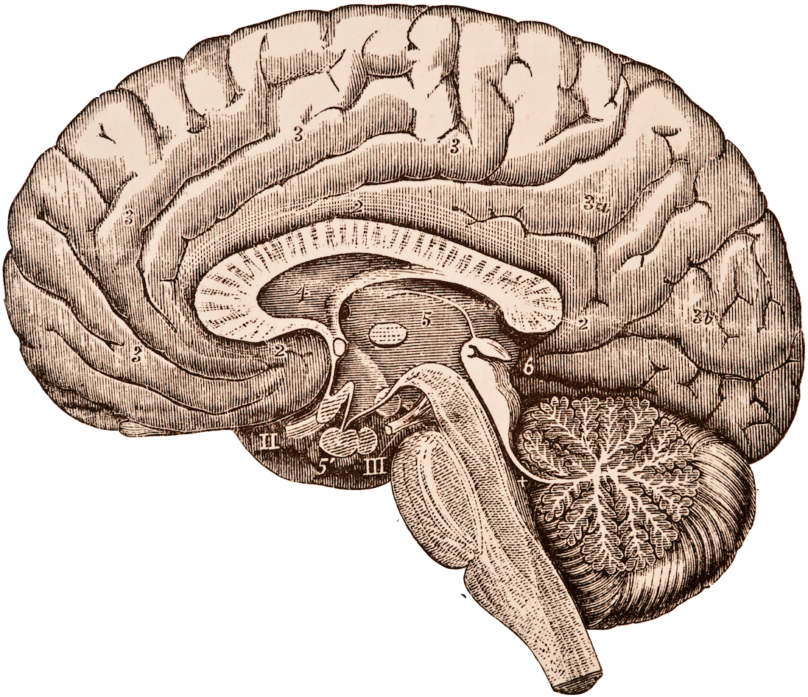
:::


::: {.fragment fragment-index='1' .slide-in-from-bottom-then-top style="position: absolute; left: 78%; top: 48%; width: 200px; height: auto;"}
{data-id="cog1"}
:::

::: {.fragment fragment-index='1' .slide-in-from-bottom-then-top style="position: absolute; left: 29%; top: 48%; width: 200px; height: auto;"}
{data-id="cog2"}
:::

::: {.fragment fragment-index='1' .slide-in-from-bottom-then-top style="position: absolute; left: 39%; top: 20%; width: 200px; height: auto;"}
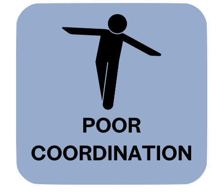{data-id="cog3"}
:::

::: {.fragment fragment-index='1' .slide-in-from-bottom-then-top style="position: absolute; left: 67%; top: 20%; width: 200px; height: auto;"}
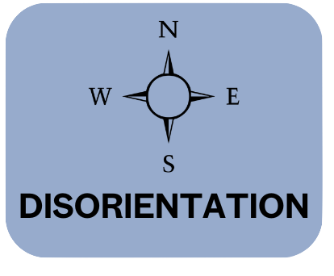{data-id="cog4"}
:::

::: {.fragment fragment-index='2' .slide-in-from-bottom-then-top style="position: absolute; left: 78%; top: 48%; width: 200px; height: auto;"}
{data-id="psych1"}
:::

::: {.fragment fragment-index='2' .slide-in-from-bottom-then-top style="position: absolute; left: 29%; top: 48%; width: 200px; height: auto;"}
{data-id="psych2"}
:::

::: {.fragment fragment-index='2' .slide-in-from-bottom-then-top style="position: absolute; left: 39%; top: 20%; width: 200px; height: auto;"}
{data-id="psych3"}
:::

::: {.fragment fragment-index='2' .slide-in-from-bottom-then-top style="position: absolute; left: 67%; top: 20%; width: 200px; height: auto;"}
{data-id="psych4"}
:::

::: {.fragment fragment-index=3 .slide-in-from-top data-id="edi-sml" style="position: absolute; top: 0%; left: 100%; width: 70px;"}

:::

::: {.fragment fragment-index='3' .fade-in style="position: absolute; left: 78%; top: 38%; width: 265px; height: auto;"}
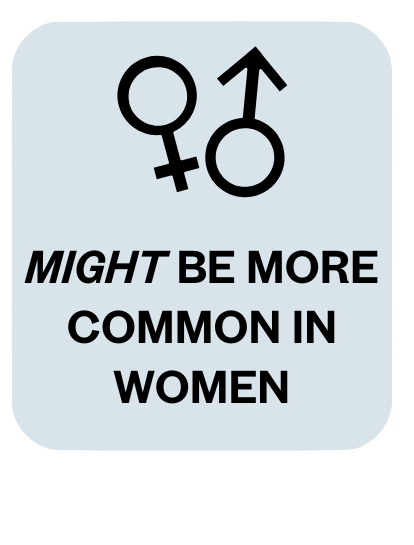{auto-animate-id="demogr1"}
:::

::: {.fragment fragment-index='3' .fade-in style="position: absolute; left: 17%; top: 38%; width: 350px; height: auto;"}
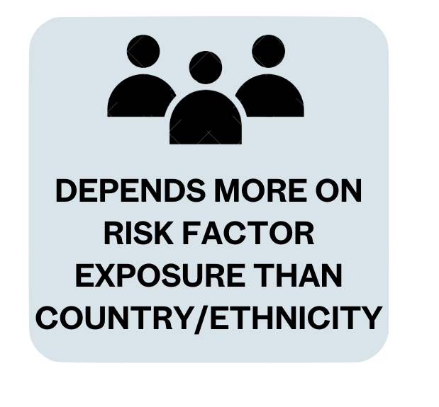{auto-animate-id="demogr2"}
:::

::: {.fragment fragment-index='3' .fade-in style="position: absolute; left: 51%; top: 9%; width: 250px; height: auto;"}
{auto-animate-id="demogr3"}
:::

::: {data-id="subtype1" style="position: absolute; left: 300px; top: -4000px; width: 950px; height: auto;"}
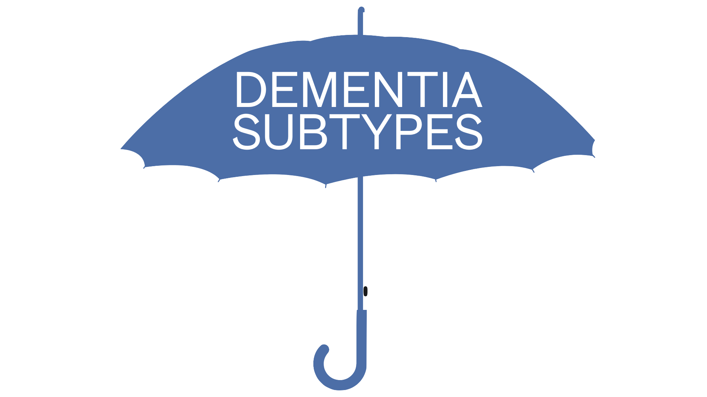
:::

::: {data-id="subtype2" style="position: absolute; left: 300px; top: 6000px; width: 950px; height: auto;"}
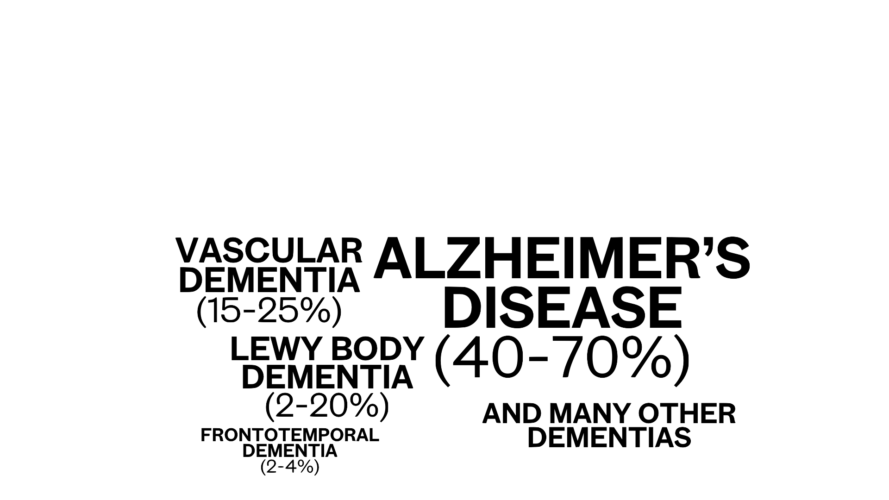
:::

## What is Dementia? {auto-animate="true"}
### A Common Neurodegenerative Disorder {style="color: gray; font-size: 23pt !important;"}

::: {style="opacity: 50%;"}
Symptoms

Demographics
:::

Subtypes


::: {data-id="subtype1" style="position: absolute; left: 23%; top: 0px; width: 950px; height: auto;"}

:::

::: {data-id="subtype2" style="position: absolute; left: 23%; top: 0px; width: 950px; height: auto;"}

:::

## What is Dementia? {auto-animate="true"}
### A Common Neurodegenerative Disorder {style="color: gray; font-size: 23pt !important;"}

::: {style="opacity: 50%;"}
Symptoms

Demographics

Subtypes
:::

Pathologies


::: {.dementia-text-box style="text-align: center; background: #385E9D; color: white; position: absolute; top: 50px; left: 600px; width: 450px; padding: 0.1em;"}

PROTEIN AGGREGATES

(tau, amyloids, others)

:::

::: {.fragment .fade-in-then-out fragment-index=1 data-id="amyloid-salahuddin" style="position: absolute; left: 400px; top: 200px; width: 950px; height: auto;"}
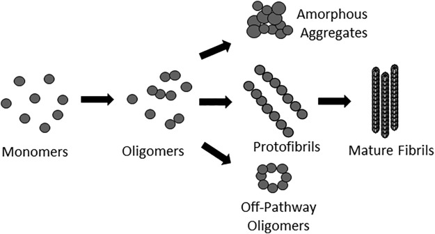
:::

::: {.fragment .fade-in fragment-index=2 .dementia-text-box style="text-align: center;  background: #385E9D; color: white; position: absolute; top: 205px; left: 600px; width: 450px; padding: 0.1em;"}

LOSS OF NEURONS and SYNAPSE CONNECTIONS
:::

::: {.fragment .fade-in fragment-index=3 .dementia-text-box style="text-align: center; background: #385E9D; color: white; position: absolute; top: 350px; left: 600px; width: 450px; padding: 0.1em;"}

CHRONIC INFLAMMATION
:::

::: {.fragment .fade-in fragment-index=4 .dementia-text-box style="text-align: center; background: #385E9D; color: white; position: absolute; top: 445px; left: 600px; width: 450px; padding: 0.1em;"}

GENETICS
:::


## [What are the Risk Factors for Dementia?]{style="font-size: 35pt;"} {.scrollable}
### ([Global](https://www.thelancet.com/journals/lancet/article/PIIS0140-6736(24)01296-0/fulltext){target="_blank"})


:::: {.fragment style="position: absolute; left: 200px; top: 100px; width: 750px; height: auto;"}
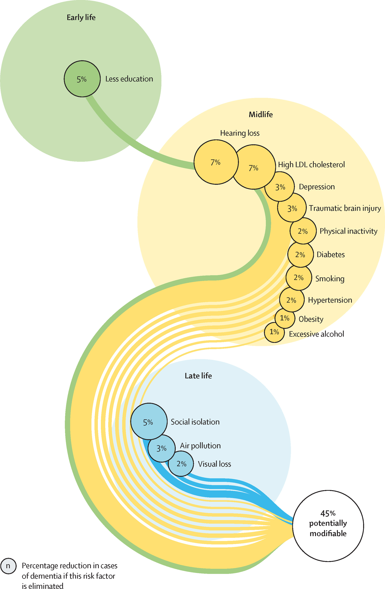

::: {data-id="4em-space" style="display:inline-block; height:4em;"}
:::

::::

## [What are the Risk Factors for Dementia?]{style="font-size: 35pt;"} {.scrollable}
### ([Canada](https://www.sciencedirect.com/science/article/pii/S2274580724006800?via%3Dihub){target="_blank"})

:::: {.fragment style="position: absolute; left: 150px; top: 100px; width: 850px; height: auto;"}
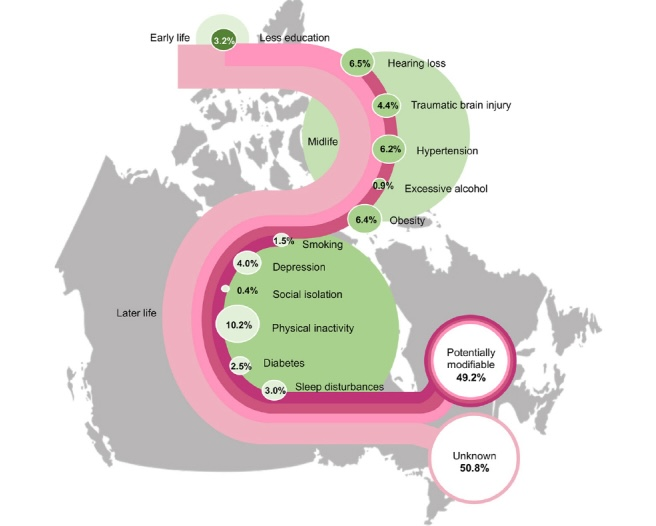

::: {data-id="4em-space" style="display:inline-block; height:4em;"}
:::

::::


## How are Hearing Loss and Dementia connected? {auto-animate="true"}


:::: {.columns}
::: {.column .fragment fragment-index=1 .fade-in-then-out style="position: absolute; left: 0%;"}
[**Causal Relationship**]{auto-animate-id="cause" style="font-size: 35pt; color: var(--lab-blue);"}
:::

::: {.column .fragment fragment-index=2 .fade-in style="position: absolute; left: 0%;"}
[**Common Cause**]{auto-animate-id="mediate" style="font-size: 35pt; color: var(--lab-blue);"}
:::
::::

::: {.fragment fragment-index=1 .fade-in-then-out .slow1 style="position: absolute; top: 265px; left: 25%; width: 750px;"}

:::

::: {.fragment fragment-index=2 .fade-in-then-out .slow1 style="position: absolute; top: 175px; left: 45%; width: 400px;"}

:::

::: {data-id="causal-sml" style="position: absolute; top: -103%; left: 86%; width: 200px; opacity: 0.5;"}

:::

## [Can Hearing Loss [cause]{style="color: var(--lab-blue);"} Dementia?]{style="font-size: 45pt;"} {auto-animate="true"}

::: {data-id="causal-sml" style="position: absolute; top: -3%; left: 86%; width: 200px; opacity: 0.5;"}

:::

::: {.fragment fragment-index=1 .fade-in}
::: {.fragment fragment-index=3 .semi-fade-out}
Altered Cognitive Load
:::
:::

::: {.fragment fragment-index=3 .fade-in-then-semi-out}
Neuroplastic Reorganization
:::

::: {.fragment fragment-index=4 .fade-in style="width: 800px; color: var(--lab-yellow);"}
[**Can we use genetics to explore causality?**]{style="font-size:45pt;"}
:::


::: {.fragment fragment-index=1 .fade-in-then-out .slow1 style="position: absolute; top: 125px; left: 450px;"}
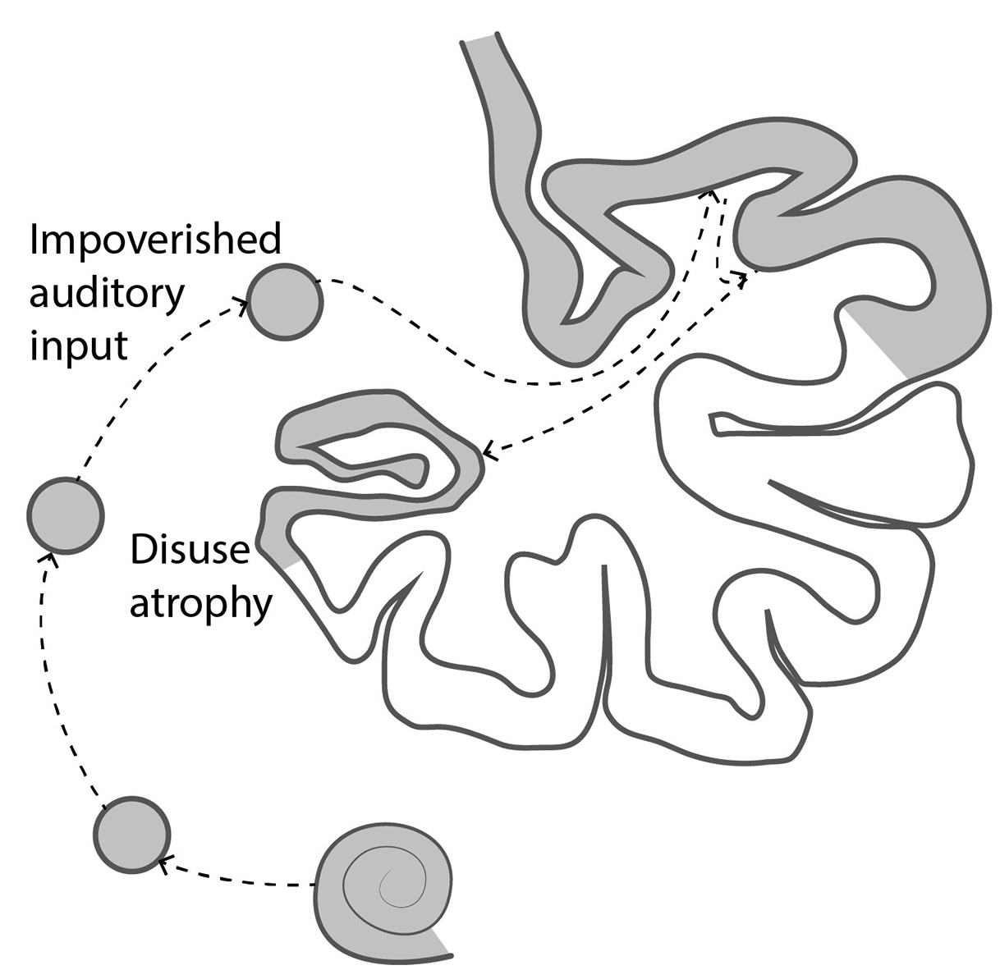{style="width:400px;"}
:::

::: {.fragment fragment-index=2 .fade-in-then-out .slow1 style="position: absolute; top: 125px; left: 450px;"}
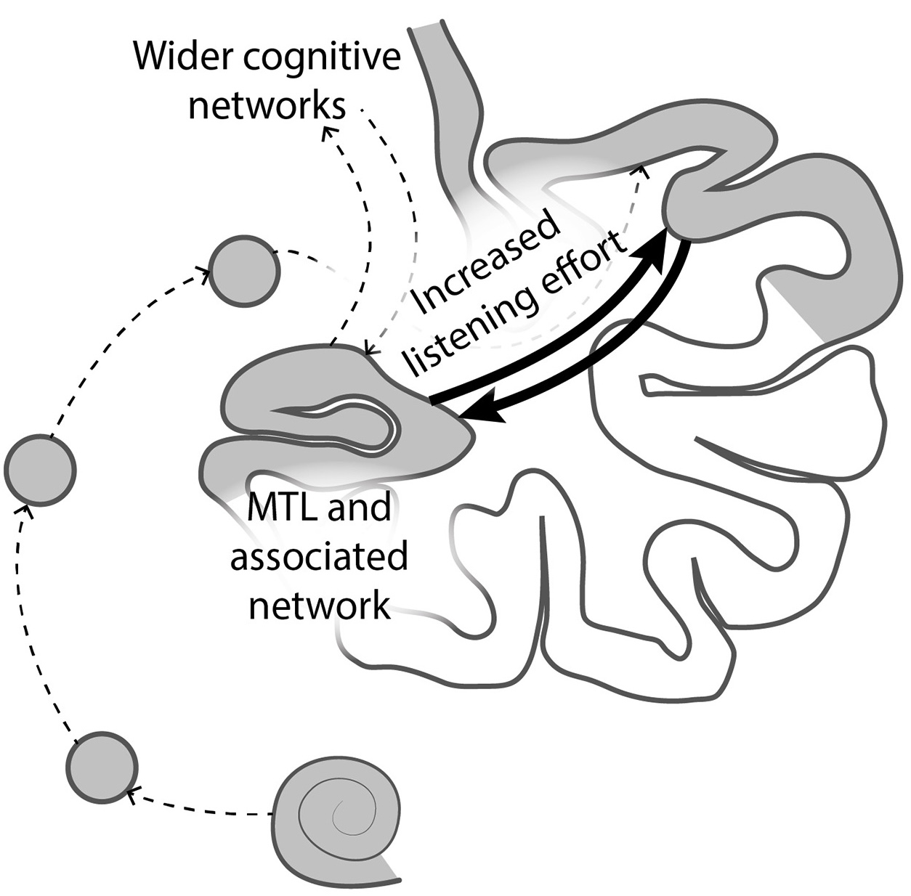{style="width:400px;"}
:::

::: {.fragment fragment-index=3 .fade-in-then-out .slow1 style="position: absolute; top: 100px; left: 550px;"}
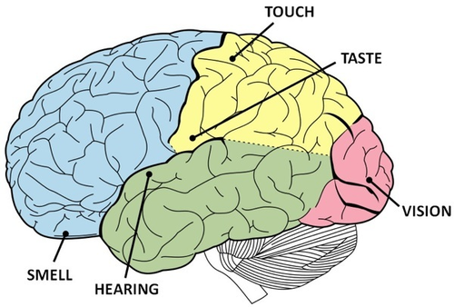{style="width:500px;"}
:::


## [Mendelian Randomization ([MR]{style="color: var(--lab-blue);"}) to explore [causality]{style="color: var(--lab-blue);"}]{style="font-size: 35pt;"} {auto-animate="true"}

:::: {.fragment fragment-index=1 .fade-out}
::: {style="position: absolute; top: 25px; left: 20px; width: 1000px;"}
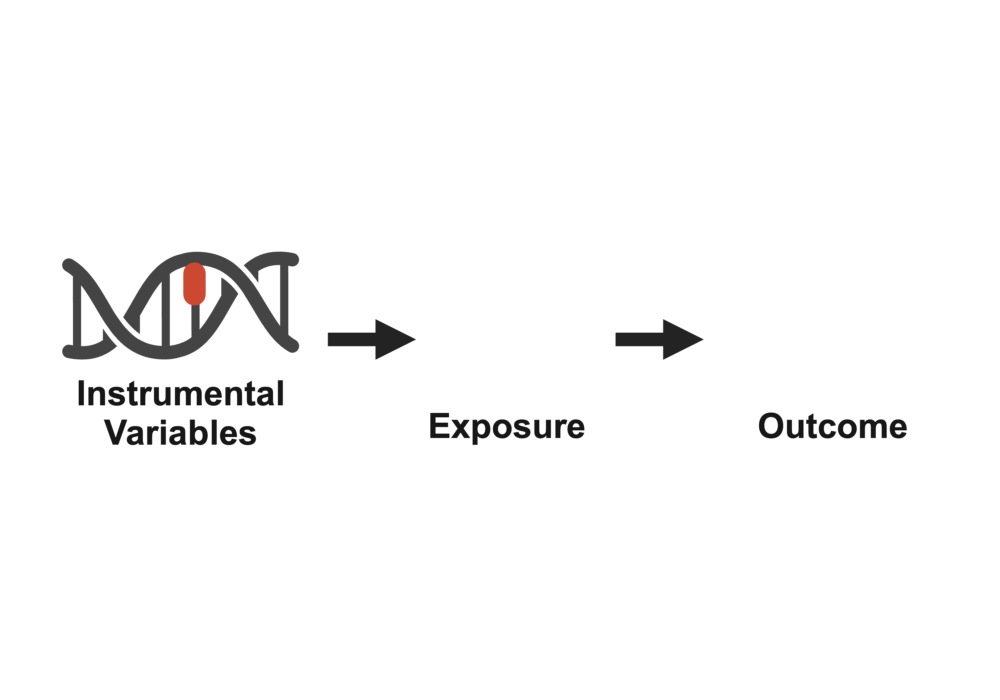
:::

::: { style="position: absolute; top: 200px; left: 425px; width: 225px;"}

:::

::: { style="position: absolute; top: 225px; left: 750px; width: 225px;"}

:::
::::

::: {.fragment fragment-index=1 .fade-in-then-out style="position: absolute; top: 0px; left: 50px; width: 1000px;"}

:::

::: {.fragment fragment-index=2 .fade-in-then-out style="position: absolute; top: 0px; left: 50px; width: 1000px;"}
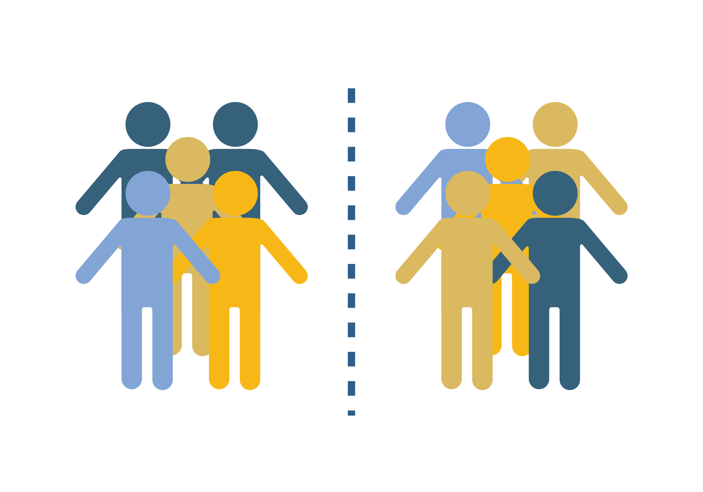
:::

::: {.fragment fragment-index=3 .fade-in-then-out style="position: absolute; top: 0px; left: 50px; width: 1000px;"}
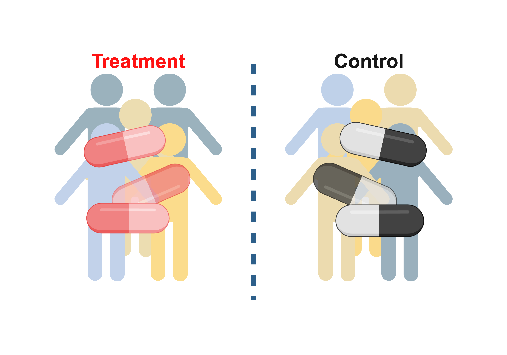
:::

::: {.fragment fragment-index=4 .fade-in-then-out style="position: absolute; top: 0px; left: 50px; width: 1000px;"}
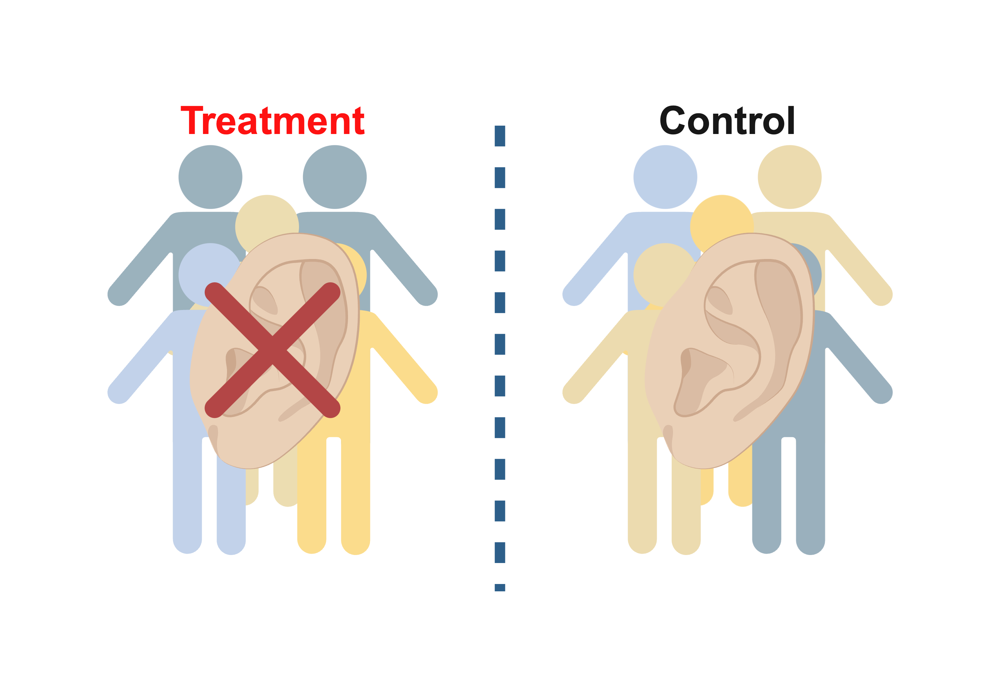
:::

::: {.fragment fragment-index=5 .fade-in-then-out style="position: absolute; top: 0px; left: 50px; width: 1000px;"}
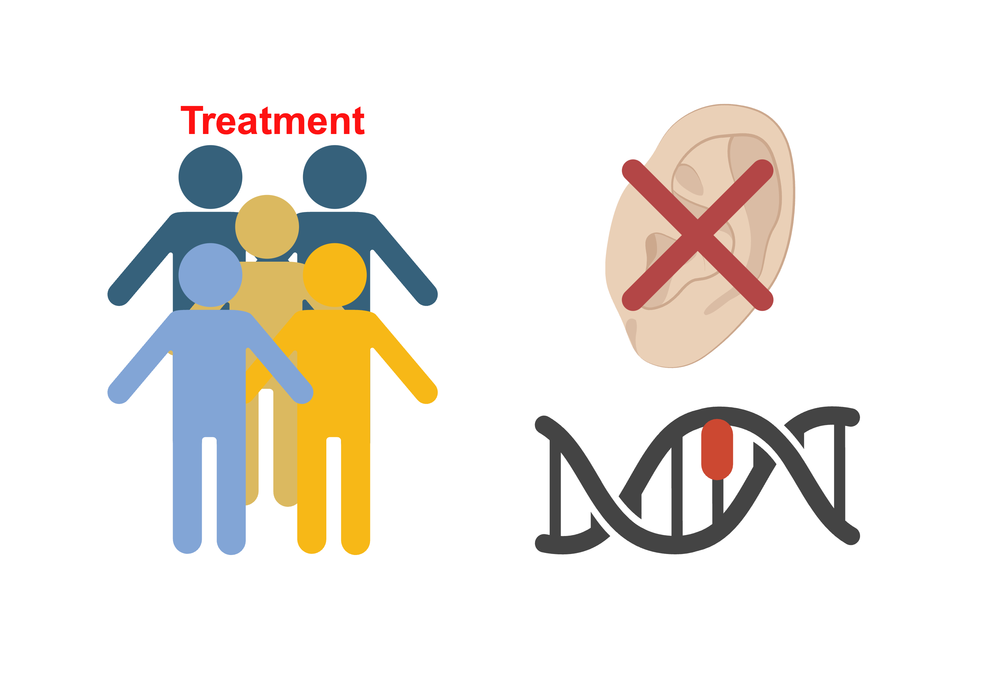
:::

::: {.fragment fragment-index=6 .fade-in-then-out style="position: absolute; top: 0px; left: 50px; width: 1000px;"}
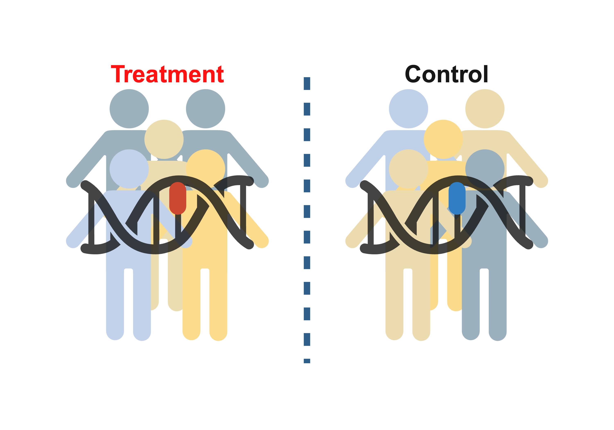
:::

:::: {.fragment fragment-index=7 .fade-in}
::: {style="position: absolute; top: 25px; left: 20px; width: 1000px;"}

:::

::: { style="position: absolute; top: 200px; left: 425px; width: 225px;"}

:::

::: {style="position: absolute; top: 225px; left: 750px; width: 225px;"}

:::
::::


::: {data-id="mediate" style="position: absolute; top: -100%; left: 50%; width: 125px; opacity: 0.5;"}

:::

## Do Hearing Loss and Dementia share a [common cause]{style="color: var(--lab-blue);"}? {auto-animate="true"}

::: {.fragment fragment-index=1 .fade-in}
Inflammation
:::

::: {.fragment fragment-index=2 .fade-in}
Poor Vascular Health
:::

::: {.fragment fragment-index=3 .fade-in}
Protein Aggregates
:::

::: {.fragment fragment-index=4 .fade-in}
Loss of Neurons/Synapses
:::

::: {.fragment fragment-index=5 .fade-in}
Genetic Factors
:::

::: {data-id="mediate" style="position: absolute; top: 6%; left: 50%; width: 125px; opacity: 0.5;"}

:::

::: {.fragment fragment-index=1 .fade-in style="position: absolute; top: 23%; left: 43%; width: 525px;"}
::: {.fragment fragment-index=6 .fade-out}
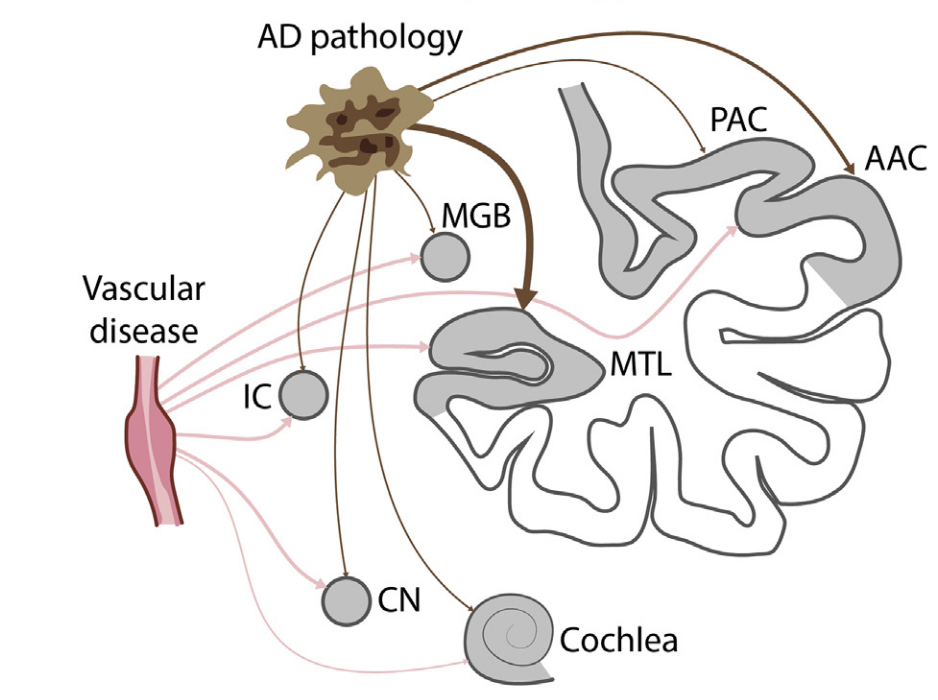
:::
:::

::: {.fragment fragment-index=6 .fade-in style="position: absolute; top: 34%; left: 47%; width: 500px; color: var(--lab-yellow); text-align: center;"}
[**Can we use genetics to find a common cause?**]{style="font-size:50pt;"}
:::


## [[MTAG]{style="color: var(--lab-blue);"} to find a [common cause]{style="color: var(--lab-blue);"}]{style="font-size: 35pt;"}{auto-animate="true"}
### (Multi-Trait Analysis of GWAS) {style="color: gray;"}

::: {.fragment fragment-index=1 .fade-out style="position: absolute; top: 150px; left: 25px; width: 1000px;"}
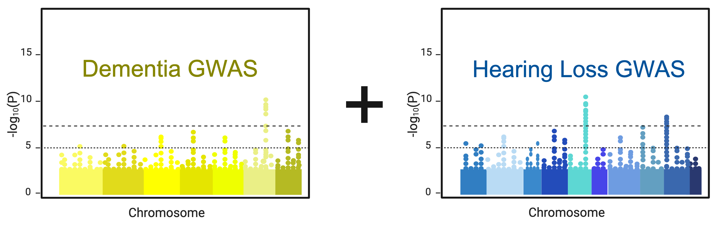
:::

::: {.fragment fragment-index=1 .fade-in}
::: {style="position: absolute; top: 150px; left: 225px; width: 500px;" data-id="mtag"}
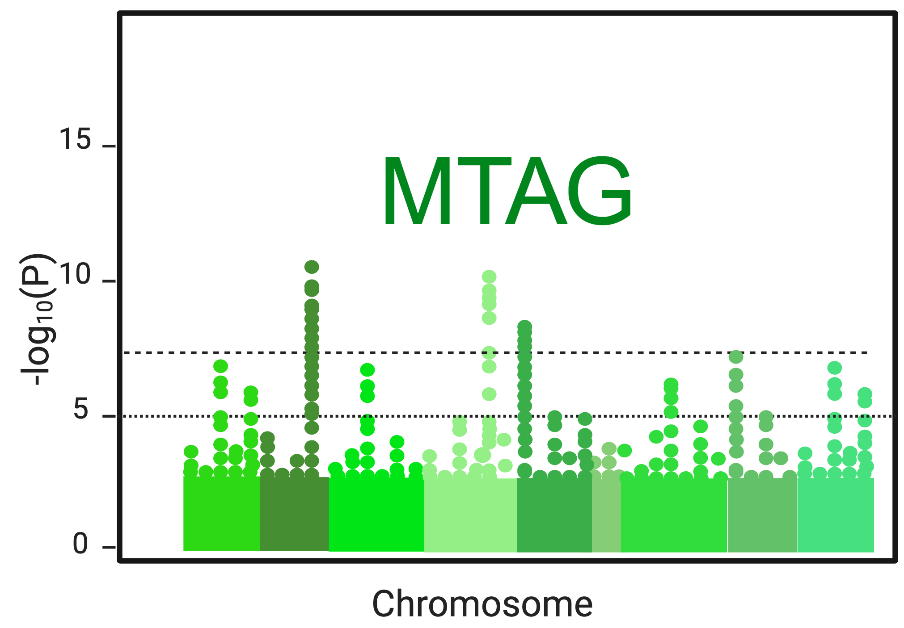
:::
:::

## [[MTAG]{style="color: var(--lab-blue);"} to find a [common cause]{style="color: var(--lab-blue);"}]{style="font-size: 35pt;"}{auto-animate="true"}
### (Multi-Trait Analysis of GWAS) {style="color: gray;"}

::: {style="width: 450px;"}
- Increases power to detect associations when the traits are genetically correlated
- Identifies variants contributing to both hearing loss and dementia
:::

::: {style="position: absolute; top: 120px; left: 500px; width: 500px;" data-id="mtag"}

:::

::: {style="position: absolute; top: 153%; left: 154%; width: 400px;" data-id="fine-map"}
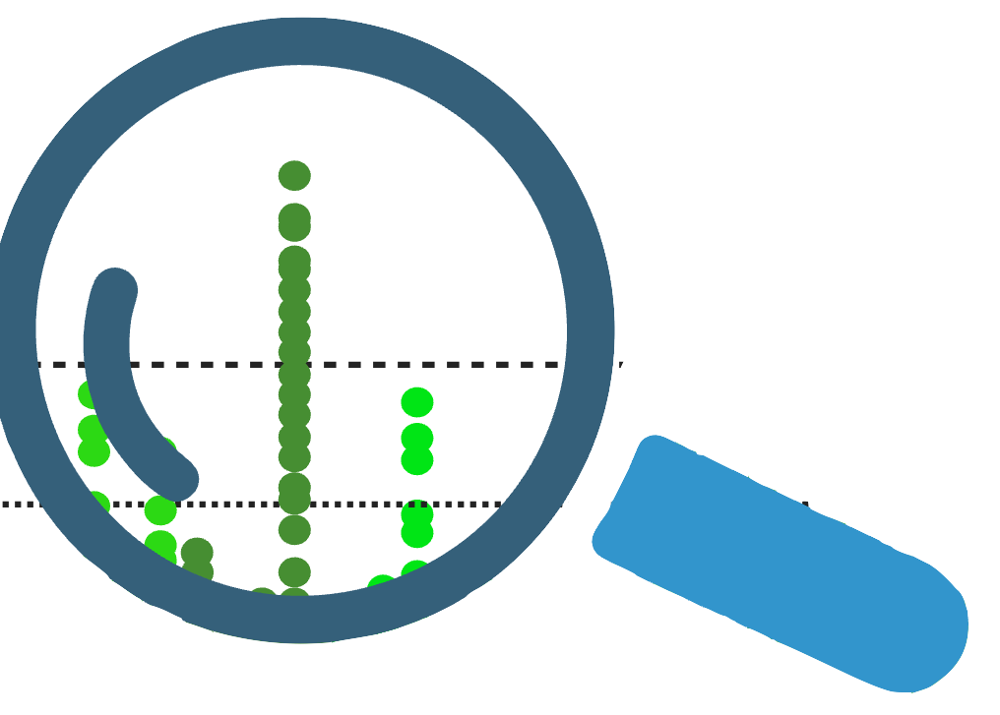
:::

## [[MTAG]{style="color: var(--lab-blue);"} to find a [common cause]{style="color: var(--lab-blue);"}]{style="font-size: 35pt;"}{auto-animate="true"}
### (Multi-Trait Analysis of GWAS) {style="color: gray;"}

::: {style="width: 400px;"}
- Fine-mapping
- Enrichment Analysis
:::

::: {style="position: absolute; top: 120px; left: 500px; width: 500px; opacity: 0.2;" data-id="mtag"}

:::

::: {style="position: absolute; top: 23%; left: 54%; width: 400px;" data-id="fine-map"}

:::

## [[No Clear Consensus]{style="color: var(--lab-blue);"} on Genetic Relationship]{style="font-size:30pt;"}

:::: {.fragment fragment-index=1 .fade-out style="position: absolute; top: 75px; left: 0px;"}
````{=html}
<style type="text/css">
.tg  {border-collapse:collapse;border-spacing:0;}
.tg td{border-color:black;border-style:solid;border-width:1px;font-family:Arial, sans-serif;font-size:14px !important;
  overflow:hidden;padding:10px 5px;word-break:normal;}
.tg th{border-color:black;border-style:solid;border-width:1px;font-family:Arial, sans-serif;font-size:14px !important;
  font-weight:normal;overflow:hidden;padding:10px 5px;word-break:normal;}
.tg .tg-0pky{border-color:inherit;text-align:left;vertical-align:top; font-size:12pt !important;}
</style>
<table class="tg"><thead>
  <tr>
    <th class="tg-0pky">Paper</th>
    <th class="tg-0pky">Study Design</th>
    <th class="tg-0pky">Sample Size</th>
    <th class="tg-0pky">Population</th>
    <th class="tg-0pky">Hearing Loss Phenotype</th>
    <th class="tg-0pky">Cog. Phenotype</th>
    <th class="tg-0pky">Finding</th>
  </tr></thead>
<tbody>
  <tr>
    <td class="tg-0pky">Mitchell 2020</td>
    <td class="tg-0pky">GWAS, MR, PGS</td>
    <td class="tg-0pky">250k</td>
    <td class="tg-0pky">European</td>
    <td class="tg-0pky">Self-reported Hearing Difficulty</td>
    <td class="tg-0pky">Clinical Diagnosis, 'AD-by-Proxy'</td>
    <td class="tg-0pky">No Causal Effect, AD PGS predicts H. Diff.</td>
  </tr>
  <tr>
    <td class="tg-0pky">Brenowitz 2020</td>
    <td class="tg-0pky">MR, PGS</td>
    <td class="tg-0pky">245k</td>
    <td class="tg-0pky">European</td>
    <td class="tg-0pky">Digital Triplet Test, Self-report</td>
    <td class="tg-0pky">Verbal Reasoning test score, AD PGS (based on 25 genetic loci)</td>
    <td class="tg-0pky">Association between AD PGS and poor speech-in-noise hearing, No Association between Hearing PGS and cognitive scores.</td>
  </tr>
  <tr>
    <td class="tg-0pky">Xu 2024</td>
    <td class="tg-0pky">MR, Cross-sectional Study</td>
    <td class="tg-0pky">500k</td>
    <td class="tg-0pky">European and Chinese</td>
    <td class="tg-0pky">Self-report, Audiometry</td>
    <td class="tg-0pky">Battery of Cognitive Tests</td>
    <td class="tg-0pky">Hearing Loss is a risk factor for cognitive impairment</td>
  </tr>
  <tr>
    <td class="tg-0pky">Wang 2022</td>
    <td class="tg-0pky">PGS, cross-sectional and longitudinal analysis</td>
    <td class="tg-0pky">500k</td>
    <td class="tg-0pky">European and Chinese</td>
    <td class="tg-0pky">Self-report, Speech-in-Noise Test</td>
    <td class="tg-0pky">Battery of Cognitive Tests, Imaging Data, cerebrospinal fluid Protein levels (tau, amyloid-beta)</td>
    <td class="tg-0pky">Hearing Impairment is associated with cognitive decline, brain atrophy, and tau levels</td>
  </tr>
  <tr>
    <td class="tg-0pky">Abidin 2021</td>
    <td class="tg-0pky">MR, Gene-set and function enrichment</td>
    <td class="tg-0pky">250k</td>
    <td class="tg-0pky">European</td>
    <td class="tg-0pky">Self-report</td>
    <td class="tg-0pky">Clinical Diagnosis</td>
    <td class="tg-0pky">No Genetic Correlation, Possible causal relationship from AD to HL via APOE locus</td>
  </tr>
  <!-- made here: https://www.tablesgenerator.com/html_tables -->
  
  <tfoot>
    <tr>
      <td colspan="7" style="text-align:left; padding-top: 10px; font-size: 12pt">
        <strong>Acronyms:</strong> <strong>AD</strong> = Alzheimer's Disease; <strong>GWAS</strong> = Genome-Wide Association Study; ; <strong>HL</strong> = Hearing Loss; <strong>MR</strong> = Mendelian Randomization; <strong>PGS</strong> = Polygenic Score.
      </td>
    </tr>
</tfoot>

</tbody>
</table>


````
::::

:::: {.fragment fragment-index=1 .fade-in-then-out style="position: absolute; top: 75px; left: 0px;"}
````{=html}

<!-- colored in "Finding" cells -->

<style type="text/css">
.tg  {border-collapse:collapse;border-spacing:0;}
.tg td{border-color:black;border-style:solid;border-width:1px;font-family:Arial, sans-serif;font-size:14px !important;
  overflow:hidden;padding:10px 5px;word-break:normal;}
.tg th{border-color:black;border-style:solid;border-width:1px;font-family:Arial, sans-serif;font-size:14px !important;
  font-weight:normal;overflow:hidden;padding:10px 5px;word-break:normal;}
.tg .tg-0pky{border-color:inherit;text-align:left;vertical-align:top; font-size: 12pt !important;}
</style>
<table class="tg"><thead>
  <tr>
    <th class="tg-0pky">Paper</th>
    <th class="tg-0pky">Study Design</th>
    <th class="tg-0pky">Sample Size</th>
    <th class="tg-0pky">Population</th>
    <th class="tg-0pky">Hearing Loss Phenotype</th>
    <th class="tg-0pky">Cog. Phenotype</th>
    <th class="tg-0pky">Finding</th>
  </tr></thead>
<tbody>
  <tr>
    <td class="tg-0pky">Mitchell 2020</td>
    <td class="tg-0pky">GWAS, MR, PGS</td>
    <td class="tg-0pky">250k</td>
    <td class="tg-0pky">European</td>
    <td class="tg-0pky">Self-reported Hearing Difficulty</td>
    <td class="tg-0pky">Clinical Diagnosis, 'AD-by-Proxy'</td>
    <td class="tg-0pky" style="background: #ffffa0;">No Causal Effect, AD PGS predicts H. Diff.</td>
  </tr>
  <tr>
    <td class="tg-0pky">Brenowitz 2020</td>
    <td class="tg-0pky">MR, PGS</td>
    <td class="tg-0pky">245k</td>
    <td class="tg-0pky">European</td>
    <td class="tg-0pky">Digital Triplet Test, Self-report</td>
    <td class="tg-0pky">Verbal Reasoning test score, AD PGS (based on 25 genetic loci)</td>
    <td class="tg-0pky" style="background: #ffffa0;">Association between AD PGS and poor speech-in-noise hearing, No Association between Hearing PGS and cognitive scores.</td>
  </tr>
  <tr>
    <td class="tg-0pky">Xu 2024</td>
    <td class="tg-0pky">MR, Cross-sectional Study</td>
    <td class="tg-0pky">500k</td>
    <td class="tg-0pky">European and Chinese</td>
    <td class="tg-0pky">Self-report, Audiometry</td>
    <td class="tg-0pky">Battery of Cognitive Tests</td>
    <td class="tg-0pky" style="background: #c3f78c;">Hearing Loss is a risk factor for cognitive impairment</td>
  </tr>
  <tr>
    <td class="tg-0pky">Wang 2022</td>
    <td class="tg-0pky">PGS, cross-sectional and longitudinal analysis</td>
    <td class="tg-0pky">500k</td>
    <td class="tg-0pky">European and Chinese</td>
    <td class="tg-0pky">Self-report, Speech-in-Noise Test</td>
    <td class="tg-0pky">Battery of Cognitive Tests, Imaging Data, cerebrospinal fluid protein levels (tau, amyloid-beta)</td>
    <td class="tg-0pky" style="background: #c3f78c;">Hearing Impairment is associated with cognitive decline, brain atrophy, and tau levels</td>
  </tr>
  <tr>
    <td class="tg-0pky">Abidin 2021</td>
    <td class="tg-0pky">MR, Gene-set and function enrichment</td>
    <td class="tg-0pky">250k</td>
    <td class="tg-0pky">European</td>
    <td class="tg-0pky">Self-report</td>
    <td class="tg-0pky">Clinical Diagnosis</td>
    <td class="tg-0pky" style="background: #ff8282;">No Genetic Correlation, Possible causal relationship from AD to HL via APOE locus</td>
  </tr>
  <!-- made here: https://www.tablesgenerator.com/html_tables -->
  
    <tfoot>
    <tr>
      <td colspan="7" style="text-align:left; padding-top: 10px; font-size: 12pt">
        <strong>Acronyms:</strong> <strong>AD</strong> = Alzheimer's Disease; <strong>GWAS</strong> = Genome-Wide Association Study; ; <strong>HL</strong> = Hearing Loss; <strong>MR</strong> = Mendelian Randomization; <strong>PGS</strong> = Polygenic Score.
      </td>
    </tr>
</tfoot>

</tbody></table>


````
::::

:::: {.fragment fragment-index=2 .fade-in style="position: absolute; top: 75px; left: 0px;"}
::: {.fragment fragment-index=3 .semi-fade-out}
````{=html}

<!-- Highlighting Phenotypes -->

<style type="text/css">
.tg  {border-collapse:collapse;border-spacing:0;}
.tg td{border-color:black;border-style:solid;border-width:1px;font-family:Arial, sans-serif;font-size:14px !important;
  overflow:hidden;padding:10px 5px;word-break:normal;}
.tg th{border-color:black;border-style:solid;border-width:1px;font-family:Arial, sans-serif;font-size:14px !important;
  font-weight:normal;overflow:hidden;padding:10px 5px;word-break:normal;}
.tg .tg-0pky{border-color:inherit;text-align:left;vertical-align:top; font-size: 12pt !important;}
</style>
<table class="tg"><thead>
  <tr>
    <th class="tg-0pky">Paper</th>
    <th class="tg-0pky">Study Design</th>
    <th class="tg-0pky">Sample Size</th>
    <th class="tg-0pky">Population</th>
    <th class="tg-0pky">Hearing Loss Phenotype</th>
    <th class="tg-0pky">Cog. Phenotype</th>
    <th class="tg-0pky">Finding</th>
  </tr></thead>
<tbody>
  <tr>
    <td class="tg-0pky">Mitchell 2020</td>
    <td class="tg-0pky">GWAS, MR, PGS</td>
    <td class="tg-0pky">250k</td>
    <td class="tg-0pky">European</td>
    <td class="tg-0pky" style="background: #e5e4e0;">Self-reported Hearing Difficulty</td>
    <td class="tg-0pky" style="background: #e5e4e0;">Clinical Diagnosis, 'AD-by-Proxy'</td>
    <td class="tg-0pky" style="background: #ffffa0;">No Causal Effect, AD PGS predicts H. Diff.</td>
  </tr>
  <tr>
    <td class="tg-0pky">Brenowitz 2020</td>
    <td class="tg-0pky">MR, PGS</td>
    <td class="tg-0pky">245k</td>
    <td class="tg-0pky">European</td>
    <td class="tg-0pky" style="background: #e5e4e0;">Digital Triplet Test, Self-report</td>
    <td class="tg-0pky" style="background: #e5e4e0;">Verbal Reasoning test score, AD PGS (based on 25 genetic loci)</td>
    <td class="tg-0pky" style="background: #ffffa0;">Association between AD PGS and poor speech-in-noise hearing, No Association between Hearing PGS and cognitive scores.</td>
  </tr>
  <tr>
    <td class="tg-0pky">Xu 2024</td>
    <td class="tg-0pky">MR, Cross-sectional Study</td>
    <td class="tg-0pky">500k</td>
    <td class="tg-0pky">European and Chinese</td>
    <td class="tg-0pky" style="background: #e5e4e0;">Self-report, Audiometry</td>
    <td class="tg-0pky" style="background: #e5e4e0;">Battery of Cognitive Tests</td>
    <td class="tg-0pky" style="background: #c3f78c;">Hearing Loss is a risk factor for cognitive impairment</td>
  </tr>
  <tr>
    <td class="tg-0pky">Wang 2022</td>
    <td class="tg-0pky">PGS, cross-sectional and longitudinal analysis</td>
    <td class="tg-0pky">500k</td>
    <td class="tg-0pky">European and Chinese</td>
    <td class="tg-0pky" style="background: #e5e4e0;">Self-report, Speech-in-Noise Test</td>
    <td class="tg-0pky" style="background: #e5e4e0;">Battery of Cognitive Tests, Imaging Data, cerebrospinal fluid Protein levels (tau, amyloid-beta)</td>
    <td class="tg-0pky" style="background: #c3f78c;">Hearing Impairment is associated with cognitive decline, brain atrophy, and tau levels</td>
  </tr>
  <tr>
    <td class="tg-0pky">Abidin 2021</td>
    <td class="tg-0pky">MR, Gene-set and function enrichment</td>
    <td class="tg-0pky">250k</td>
    <td class="tg-0pky">European</td>
    <td class="tg-0pky" style="background: #e5e4e0;">Self-report</td>
    <td class="tg-0pky" style="background: #e5e4e0;">Clinical Diagnosis</td>
    <td class="tg-0pky" style="background: #ff8282;">No Genetic Correlation, Possible causal relationship from AD to HL via APOE locus</td>
  </tr>
  <!-- made here: https://www.tablesgenerator.com/html_tables -->
  
    <tfoot>
    <tr>
      <td colspan="7" style="text-align:left; padding-top: 10px; font-size: 12pt">
        <strong>Acronyms:</strong> <strong>AD</strong> = Alzheimer's Disease; <strong>GWAS</strong> = Genome-Wide Association Study; ; <strong>HL</strong> = Hearing Loss; <strong>MR</strong> = Mendelian Randomization; <strong>PGS</strong> = Polygenic Score.
      </td>
    </tr>
</tfoot>

</tbody></table>


````
:::
::::

::: {.fragment fragment-index=3 .overview-text-box .fade-in style="color: white; background: var(--lab-yellow); position: absolute; top: 27%; left: 1%; width: 425px; padding-top: 0.1em;"}

[Phenotypes]{style="text-decoration: underline;"}

::: {style="font-size:23pt; text-align: center; line-height: 3;"}
- Is "self-report" data objective?

- Hearing loss is heterogenous (causes, pathologies, etc.)
:::

:::

## [Evidence for a [Genetic Correlation]{style="color: var(--lab-blue);"} between Specific Hearing Loss Subtypes and Dementia]{style="font-size: 30pt;"}

::: {style="width: 400px;"}

::: {.fragment fragment-index=1 .fade-in}
::: {.fragment fragment-index=4 .semi-fade-out}
- Model-based hearing loss phenotype
:::
:::

::: {.fragment fragment-index=4 .fade-in}
- Genes linked to dementia were also associated with **metabolic** hearing loss ([preprint!](https://www.medrxiv.org/content/10.1101/2025.01.14.24318673v1.full-text))
:::

:::

::: {.fragment fragment-index=1 .fade-in-then-out style="position: absolute; top: 100px; left: 500px;"}
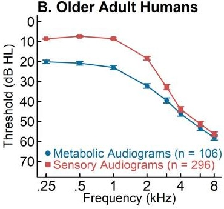{style="width: 450px;"}
:::

::: {.fragment fragment-index=2 .fade-in-then-out style="position: absolute; top: 100px; left: 500px;"}
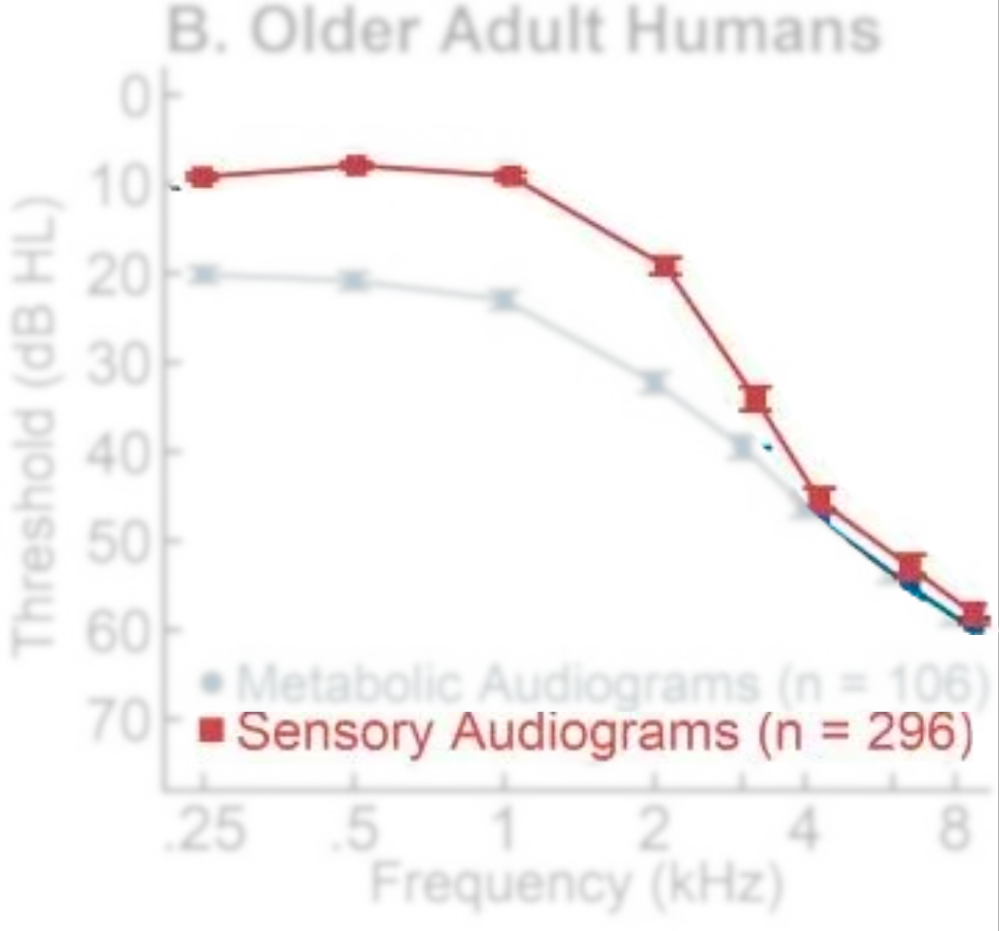{style="width: 450px;"}
:::

::: {.fragment fragment-index=3 .fade-in-then-out style="position: absolute; top: 100px; left: 500px;"}
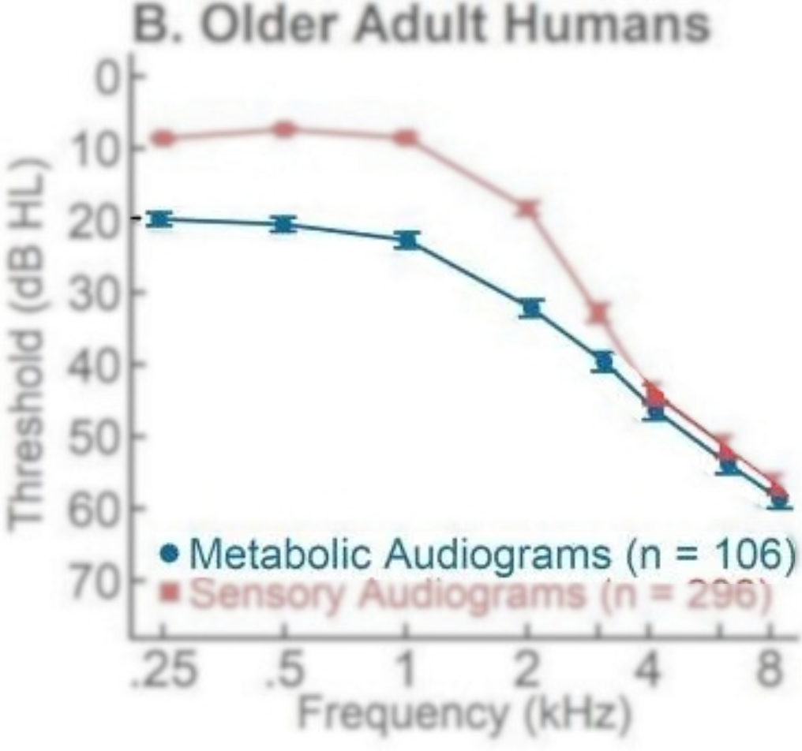{style="width: 450px;"}
:::

::: {.fragment fragment-index=4 .fade-in .overview-text-box style="color: white; background: gray; position: absolute; top: 150px; left: 500px; width: 500px; font-size: 50pt; padding-top: 0.1em;"}
*ARHGEF28*

*IPO7*

*FUS*
:::


## Project Overview {data-name="Overview" auto-animate="true"}

::: {.fragment .fade-in fragment-index=1 .overview-text-box style="color: white; background: #385E9D; position: absolute; top: 100px; left: 50px; width: 1000px;"}

[Hypothesis]{style="text-decoration: underline;"}

[Using clear hearing and cognitive phenotypes, we can better understand the genetic relationship between ARHL and dementia.]{style="font-size: 27pt;"}
:::

::: {.fragment .fade-in fragment-index=2 .overview-text-box data-id="aim1-box" style="text-align: center; background: gray; color: white; position: absolute; top: 300px; left: 50px; width: 450px; padding: 0.5em;"}

Aim 1: Underlying Genetics

::: {.fragment .fade-in fragment-index=3}
[- Causal Relationship (MR)]{style="font-size: 23pt;"}
:::

::: {.fragment .fade-in fragment-index=4}
[- Common Cause (MTAG)]{style="font-size: 23pt;"}
:::
:::

::: {.fragment .fade-in fragment-index=5 .overview-text-box data-id="aim2-box" style="text-align: center; background: gray; color: white; position: absolute; top: 300px; left: 560px; width: 450px; padding: 0.5em;"}

Aim 2: Prediction Model

::: {.fragment .fade-in fragment-index=6}
[- PGS robust to Ancestry Differences (SBayesRC)]{style="font-size: 23pt; text-align: center;"}
:::

:::

## Project Overview {auto-animate="true"}

::: {.overview-text-box style="color: white; background: #385E9D; position: absolute; top: 100px; left: 50px; width: 1000px;"}

[Hypothesis]{style="text-decoration: underline;"}

[Using clear hearing and cognitive phenotypes, we can better understand the genetic relationship between ARHL and dementia.]{style="font-size: 27pt;"}
:::


::: {.overview-text-box data-id="aim1-box" style="text-align: center; background: var(--lab-yellow); color: white; position: absolute; top: 300px; left: 325px; width: 450px; padding: 0.5em; z-index: 1;"}

Aim 1: Underlying Genetics

::: {style="font-size: 23pt;"}
- Causal Relationship (MR)

- Common Cause (MTAG)
:::
:::

::: {.overview-text-box data-id="aim2-box" style="text-align: center; background: lightgray; opacity: 0.6; color: white; position: absolute; top: 300px; left: 760px; width: 450px; padding: 0.5em;"}

Aim 2: Prediction Model

[- PGS robust to Ancestry Differences (SBayesRC)]{style="font-size: 23pt; text-align: center;"}


:::


## [What [data]{style="color: var(--lab-blue);"} are we using?]{style="font-size: 40pt;"} {data-name="Data" auto-animate="true"}
### (Canadian Longitudinal Study on Aging) {style="color: gray; font-size: 18pt !important;"}

::: {.fragment fragment-index=1 .fade-in-then-out style="position: absolute; left: 250px; top: 100px; width: 600px; height: auto;"}
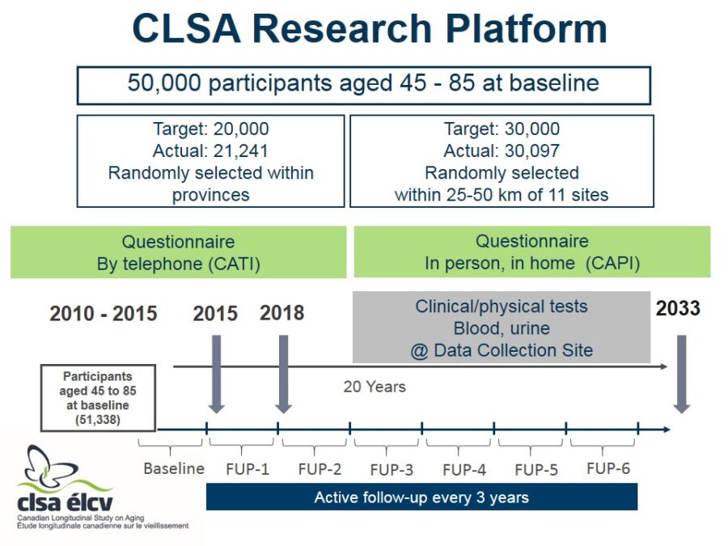
:::

::: {.fragment fragment-index=2 .fade-in-then-out style="position: absolute; left: 250px; top: 100px; width: 600px; height: auto;"}
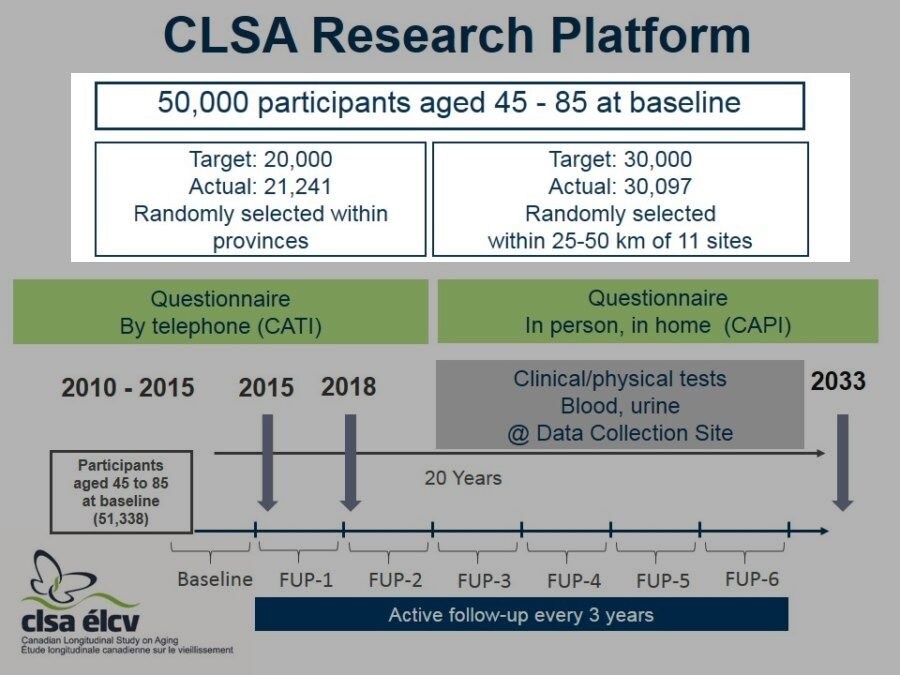
:::

::: {.fragment fragment-index=3 .fade-in-then-out style="position: absolute; left: 250px; top: 100px; width: 600px; height: auto;"}
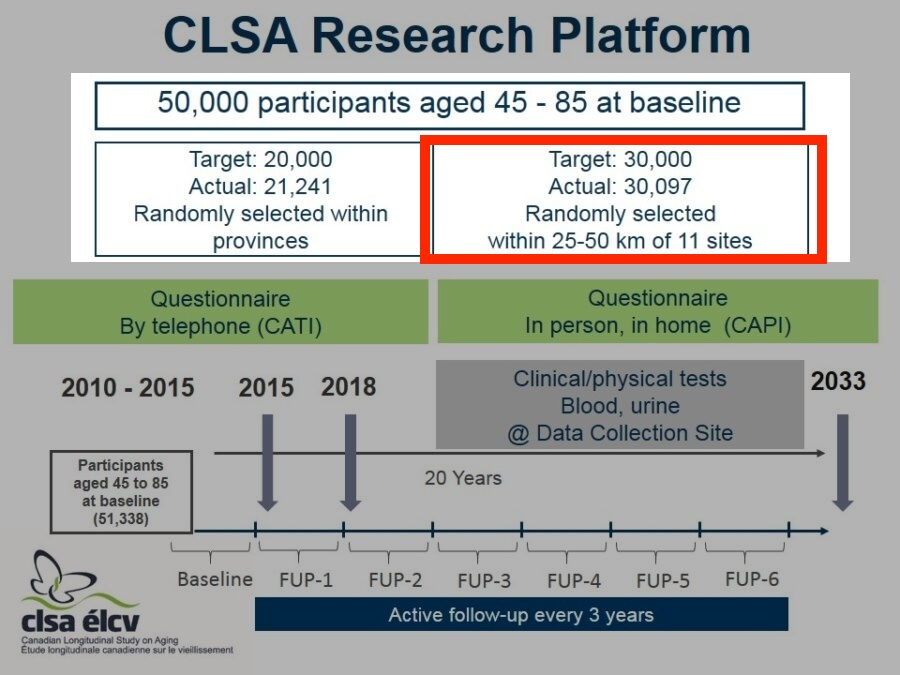
:::

::: {.fragment fragment-index=3 .fade-in-then-out style="position: absolute; left: 850px; top: 200px; width: 600px; height: auto; color: red; font-size: 20pt;"}
Comprehensive Cohort
:::

::: {.fragment fragment-index=4 .fade-in-then-out style="position: absolute; left: 250px; top: 100px; width: 600px; height: auto;"}
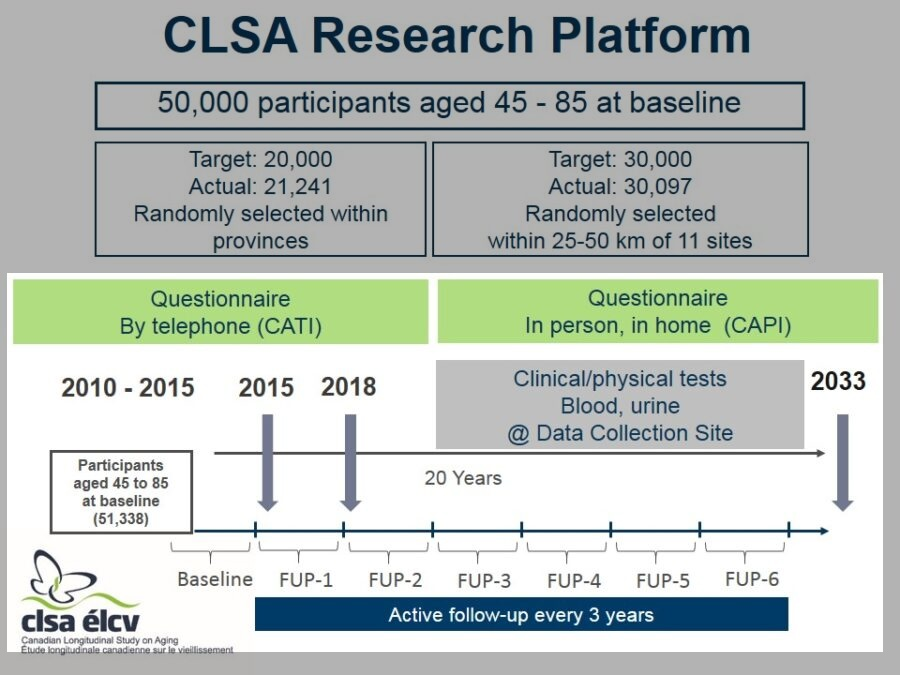
:::

::: {.fragment fragment-index=5 .fade-in-then-out style="position: absolute; left: 250px; top: 100px; width: 600px; height: auto;"}
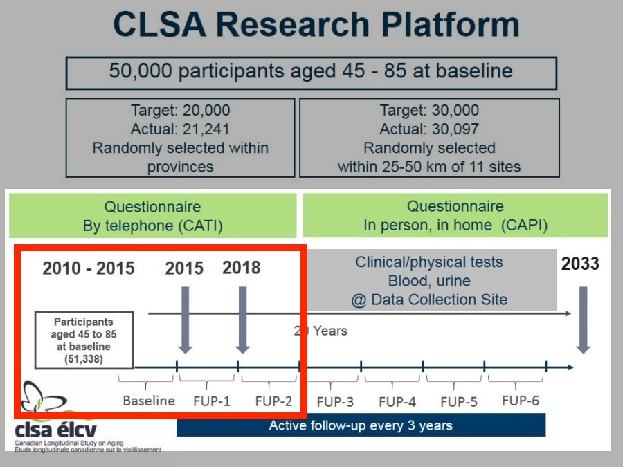
:::

::: {.fragment fragment-index=5 .fade-in-then-out style="position: absolute; left: 45px; top: 350px; width: 200px; height: auto; color: red; font-size: 20pt; text-align: right;"}
Cross-Sectional and Longitudinal Data
:::

::: {.fragment fragment-index=6 .fade-in style="position: absolute; left: 250px; top: 100px; width: 600px; height: auto; opacity: 0.4" data-id="clsa-fade"}

:::

::: {.fragment fragment-index=6 .fade-in style="position: absolute; left: 32%; top: 37%; width: 600px; height: auto; color: red; font-size: 50pt;" data-id="2686-vars"}
2686 variables!
:::

::: {style="position: absolute; left: 33%; top: 155%; width: 400px; height: auto;" data-id="xkcd"}
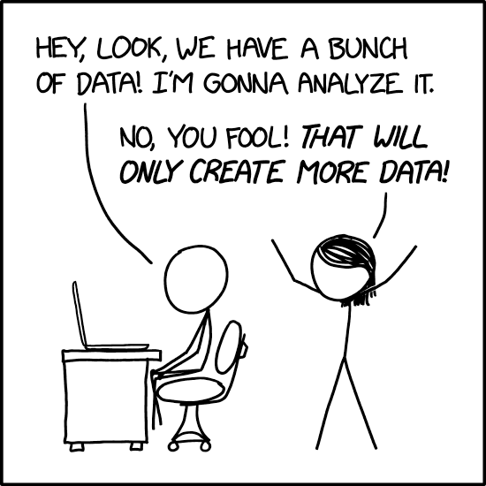
:::

## [What [data]{style="color: var(--lab-blue);"} are we using?]{style="font-size: 40pt;"} {auto-animate="true"}
### (Canadian Longitudinal Study on Aging) {style="color: gray; font-size: 18pt !important;"}

::: {style="position: absolute; left: 250px; top: 100px; width: 600px; height: auto; opacity: 0.2" data-id="clsa-fade"}

:::

::: {style="position: absolute; left: 32%; top: 12%; width: 600px; height: auto; color: red; font-size: 50pt;" data-id="2686-vars"}
2686 variables!
:::

::: {style="position: absolute; left: 33%; top: 22%; width: 400px; height: auto;" data-id="xkcd"}

:::

::: {data-id="edi-sml" style="position: absolute; top: -100%; left: 100%; width: 70px;"}

:::


## CLSA {auto-animate="true"}
### Demographics {style="color: gray;"}

::: {data-id="edi-sml" style="position: absolute; top: 0%; left: 100%; width: 70px;"}

:::

::: {.fragment fragment-index=1 .slide-out-to-left style="position: absolute; left: 250px; top: 50px; width: 750px; height: auto;"}
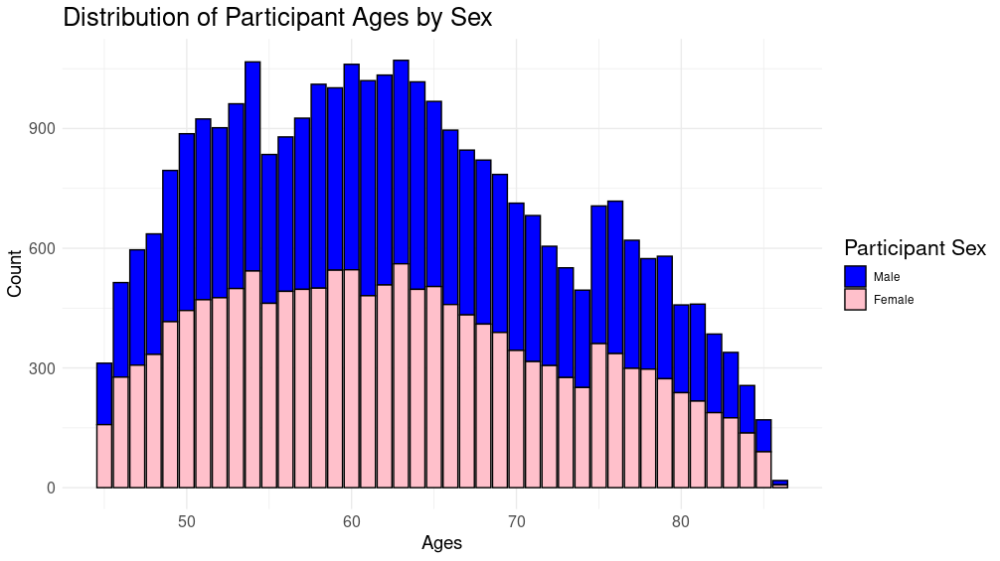
:::


::: {.fragment fragment-index=1 .slide-in-from-right-then-left style="position: absolute; left: 350px; top: 10px; width: 650px; height: auto;"}
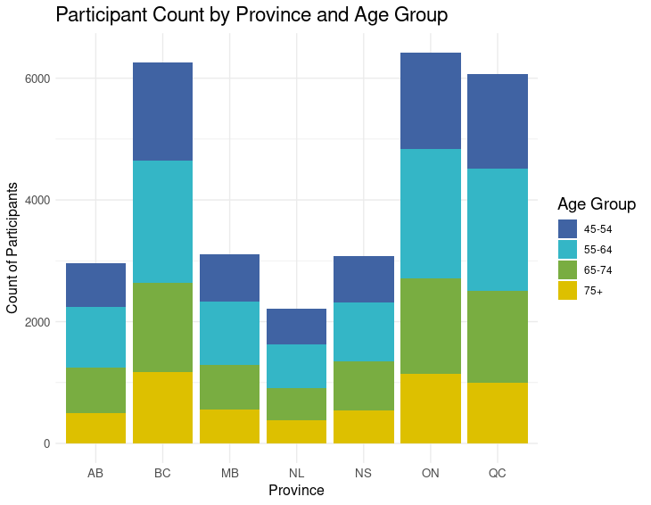
:::

::: {.fragment fragment-index=2 .slide-in-from-right-then-left style="position: absolute; left: 350px; top: 10px; width: 650px; height: auto;"}
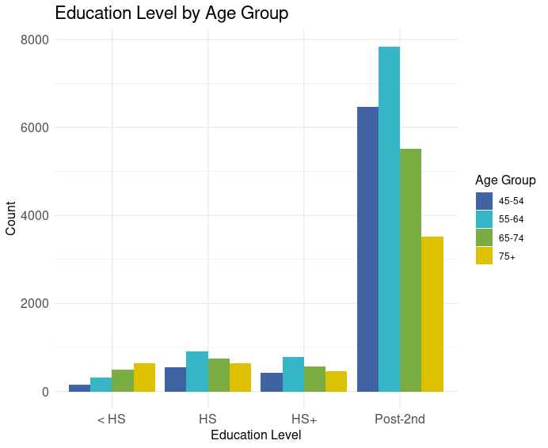
:::

::: {.fragment fragment-index=3 .slide-in-from-right style="position: absolute; left: 350px; top: 10px; width: 650px; height: auto;"}
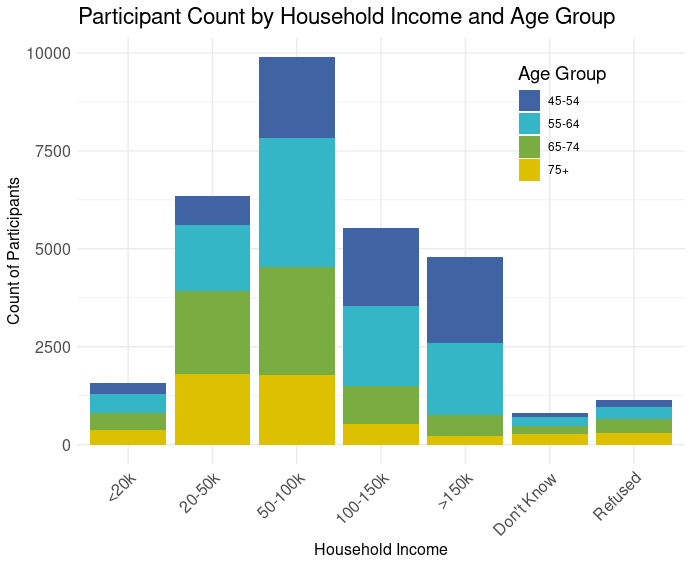
:::

## [What is our [Dementia Phenotype]{style="color: var(--lab-blue);"}?]{style="font-size: 40pt;"}
### [Cognitive Impairment Indicator]{style="color: var(--lab-blue);"} {style="font-size: 20pt !important;"}

::: {.fragment fragment-index=1 .fade-in-then-out style="width: 300px; position: absolute; top: 28%; left: 5%; font-size: 35pt;"}

[Memory]{style="color: var(--lab-yellow)"}

[Executive Function]{style="color: var(--lab-blue)"}
:::

::: {.fragment fragment-index=1 .fade-out style="position: absolute; left: 30%; top: 15%; width: 750px; height: auto;"}
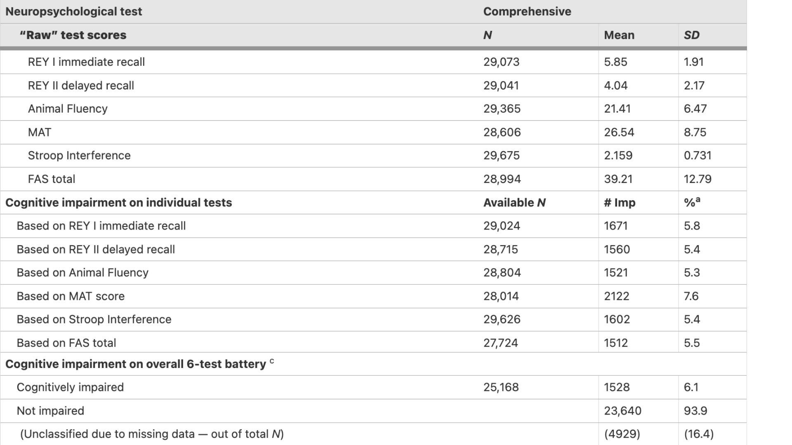
:::

::: {.fragment fragment-index=1 .fade-in-then-out style="position: absolute; left: 30%; top: 15%; width: 750px; height: auto;"}
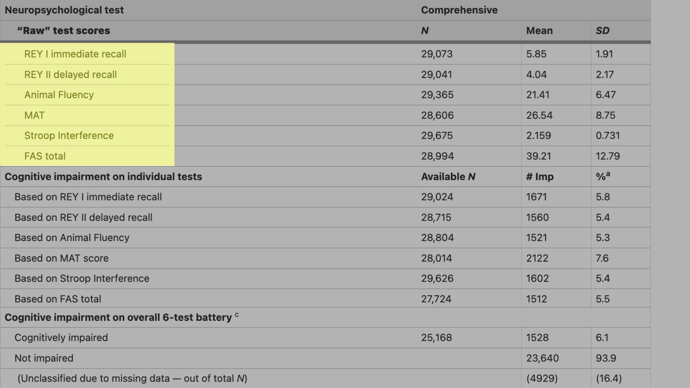
:::

::: {.fragment fragment-index=1 .fade-in-then-out style="position: absolute; left: 50%; top: 20%; width: 550px; height: auto;"}
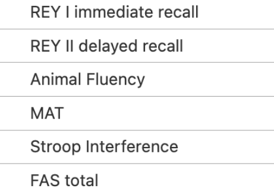
:::

::: {.fragment fragment-index=2 .fade-in-then-out style="position: absolute; left: 30%; top: 15%; width: 750px; height: auto;"}
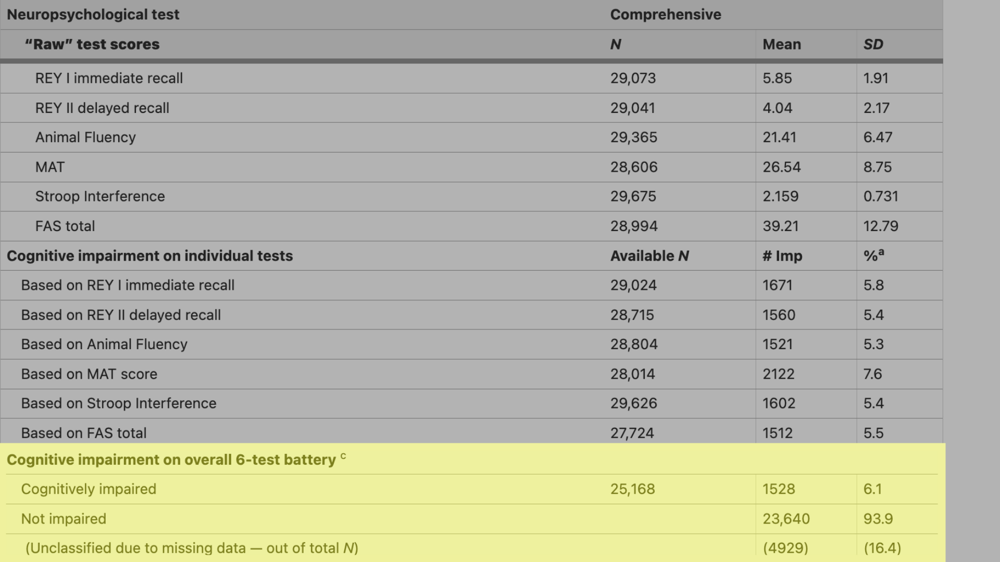
:::

::: {.fragment fragment-index=2 .fade-in-then-out style="position: absolute; left: 10%; top: 40%; width: 950px; height: auto;"}
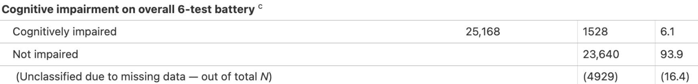
:::


::: {.fragment fragment-index=3 .slide-in-from-right-then-fade .slow3 style="position: absolute; left: 50%; top: 10%; width: 300px; height: auto;"}

:::

:::: {style="position: absolute; top: 17%;"}

::: {.fragment fragment-index=3 .slide-in-from-bottom-then-top .slow1}
Vision Loss
:::

::: {.fragment fragment-index=3 .slide-in-from-bottom-then-top}
Hypertension
:::

::: {.fragment fragment-index=3 .slide-in-from-bottom-then-top .slow1}
Depression
:::

::: {.fragment fragment-index=3 .slide-in-from-bottom-then-top}
TBI
:::

::: {.fragment fragment-index=3 .slide-in-from-bottom-then-top .slow1}
Diabetes
:::

::: {.fragment fragment-index=3 .slide-in-from-bottom-then-top}
Smoking and Alcohol
:::

::: {.fragment fragment-index=3 .slide-in-from-bottom-then-top .slow2}
Social Activity
:::

::::

::: {.fragment fragment-index=4 .slide-in-from-top data-id="edi-sml" style="position: absolute; top: 0%; left: 100%; width: 70px;"}

:::

::: {.fragment fragment-index=4 .slide-in-from-left-then-right style="position: absolute; left: 400px; top: 60px; width: 500px; height: auto;"}
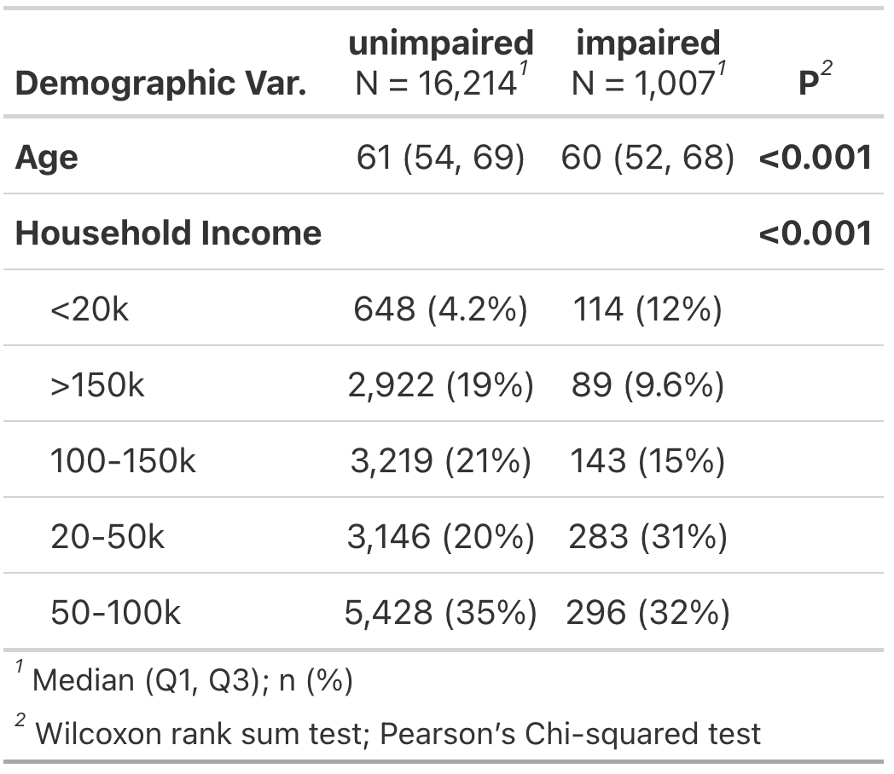
:::

::: {.fragment fragment-index=5 .slide-in-from-left-then-right style="position: absolute; left: 38%; top: 9%; width: 400px; height: auto;"}
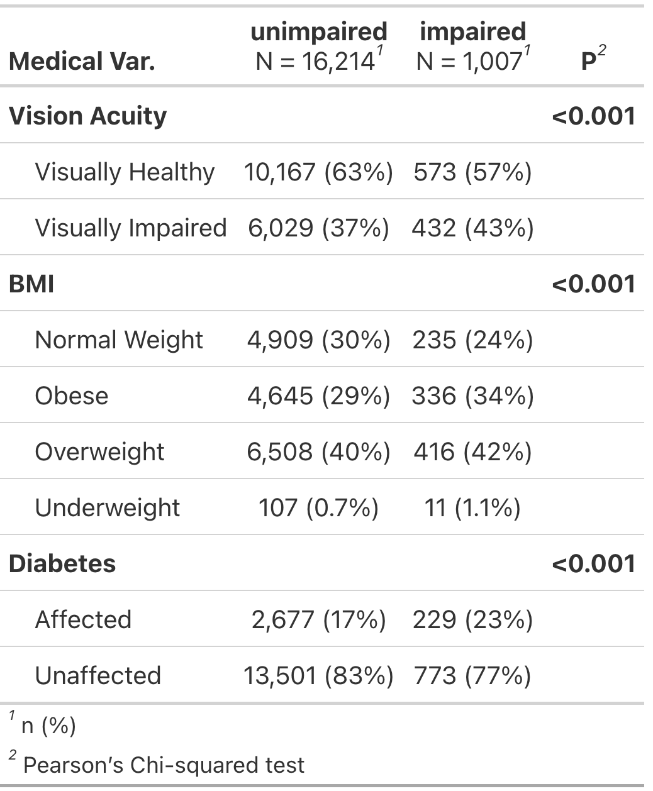
:::

::: {.fragment fragment-index=6 .slide-in-from-left-then-right style="position: absolute; left: 38%; top: 9%; width: 375px; height: auto;"}
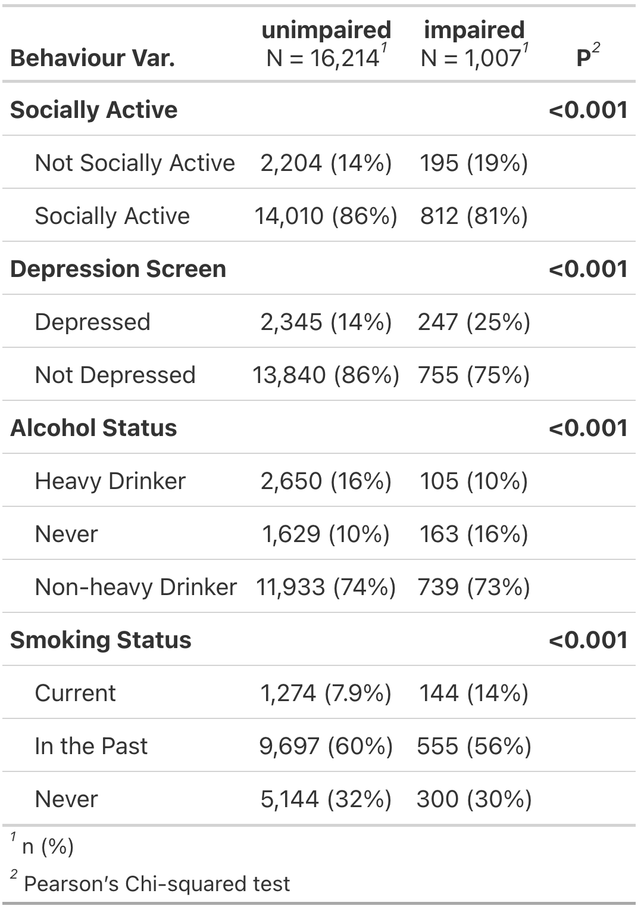
:::


## [What is our [Hearing Loss Phenotype]{style="color: var(--lab-blue);"}?]{style="font-size: 40pt;"} {auto-animate="true"}
### [ARHL Subtype Estimates]{style="color: var(--lab-blue);"}

::: {style="position: absolute; top: 100px; left: 500px;"}
{style="width: 475px;"}
:::

:::: {style="width: 500px;"}
Metabolic Hearing Loss

Sensory Hearing Loss
::::

## [What is our [Hearing Loss Phenotype]{style="color: var(--lab-blue);"}?]{style="font-size: 40pt;"} {auto-animate="true"}
### [ARHL Subtype Estimates]{style="color: var(--lab-blue);"}

::: {style="position: absolute; top: 100px; left: 500px;"}
{style="width: 475px;"}
:::

:::: {style="width: 500px;"}

**Metabolic Hearing Loss**

::: {style="font-size:23pt;"}
Strongly correlated with:

- Age
- Cognitive impairment (*P*: 3x10^-9^)
:::


::::

## [What is our [Hearing Loss Phenotype]{style="color: var(--lab-blue);"}?]{style="font-size: 40pt;"} {auto-animate="true"}
### [ARHL Subtype Estimates]{style="color: var(--lab-blue);"}

::: {style="position: absolute; top: 100px; left: 500px;"}
{style="width: 475px;"}
:::

:::: {style="width: 500px;"}

**Sensory Hearing Loss**

::: {style="font-size:23pt;"}
Not strongly correlated with:

- Age
- Cognitive impairment (*P*: 0.35)
:::
::::

## What's in the CLSA [Genotype Data]{style="color: var(--lab-blue);"}?

::: {.fragment fragment-index=1 .slide-in-from-top data-id="edi-sml" style="position: absolute; top: 0%; left: 100%; width: 70px;"}

:::

::: {.fragment fragment-index=1 .fade-in-then-semi-out}
26,622 Individuals
:::

::: {.fragment fragment-index=2 .fade-in-then-semi-out}
794k genotyped variants

308 million imputed variants
:::

::: {.fragment fragment-index=3 .fade-in}
Extensive QC
:::

::: {.fragment fragment-index=1 .fade-in style="position: absolute; left: 500px; top: 60px; width: 600px; height: auto;"}
::: {.fragment fragment-index=4 .fade-out}
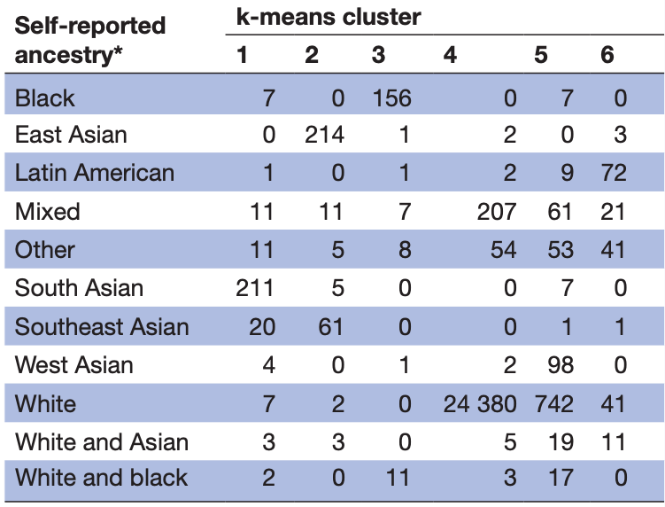
:::
:::

::: {.fragment fragment-index=4 .fade-in style="position: absolute; left: 500px; top: 60px; width: 600px; height: auto;"}
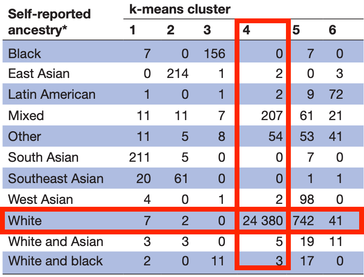
:::

## Current Step {auto-animate="true"}

::: {.fragment fragment-index=1 .fade-in style="position: absolute; top: 10%; left: 0%; width: 400px;"}
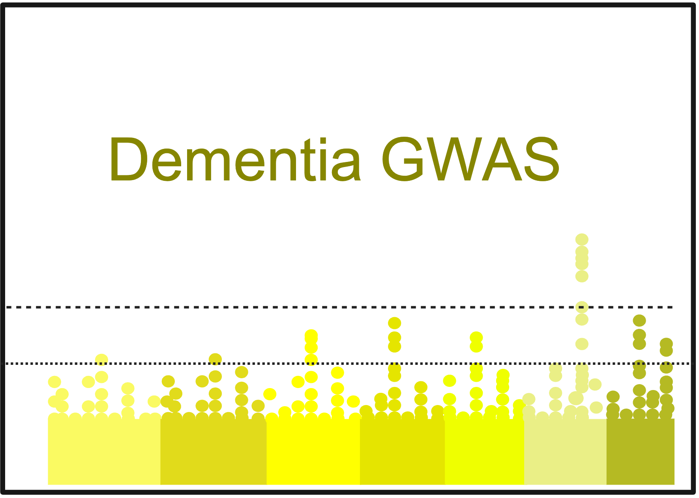
:::

::: {.fragment fragment-index=2 .slide-in-from-right .slow1 style="position: absolute; top: 15%; left: 40%; width: 400px;"}
- Identify Covariates
- Perform GWAS ([PLINK]{style="color:gray;"})
:::

::: {.fragment fragment-index=3 .slide-in-from-right .slow1 style="position: absolute; top: 3%; left: 75%; width: 330px;"}

:::

## Next Steps {data-name="Future" auto-animate="true"}

:::: {style="width:400px; font-size: 26pt;"}
::: {.fragment fragment-index=2 .fade-in-then-semi-out}
Measure causal relationship ([MR-APSS]{style="color:gray;"})
:::

::: {.fragment fragment-index=3 .fade-in-then-semi-out}
Identify correlated genetic loci ([MTAG]{style="color:gray;"})
:::

::: {.fragment fragment-index=4 .fade-in}
Identify likely causal variants ([PolyFun/SuSiE]{style="color:gray;"})
:::
::::

::: {style="position: absolute; top: -5%; left: 45%; width: 500px;"}
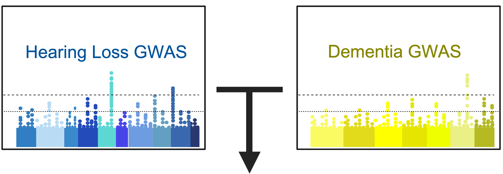
:::

::: {.overview-text-box .fragment fragment-index=1 .fade-in data-id="aim1-box2" style="text-align: center; background: var(--lab-yellow); color: white; position: absolute; top: 25%; left: 45%; width: 450px; padding: 0.5em; z-index: 1;"}

Aim 1: Underlying Genetics

::: {style="font-size: 23pt;"}
- Causal Relationship (MR)
:::

::: {style="font-size: 23pt;"}
- Common Cause (MTAG)
:::
:::

::: {.fragment fragment-index=2 .fade-in .slow4 data-id="arrow" style="position: absolute; top: 22%; left: 66.75%; width: 35px;"}

:::

::: {.overview-text-box data-id="aim2-box2" style="text-align: center; background: gray; color: white; position: absolute; top: 153%; left: 47%; width: 450px; z-index: 1;"}
[Aim 2: Prediction Model]{style="font-size: 23pt;"}
:::

## Next Steps {auto-animate="true"}

::: {style="position: absolute; top: -5%; left: 45%; width: 500px;"}

:::

::: {.overview-text-box data-id="aim1-box2" style="text-align: center; background: var(--lab-yellow); color: white; position: absolute; top: 24%; left: 47%; width: 450px; z-index: 1;"}
[Aim 1: Underlying Genetics]{style="font-size: 23pt;"}
:::

::: {data-id="arrow" style="position: absolute; top: 34%; left: 66.75%; width: 35px; height"}

:::

::: {.overview-text-box data-id="aim2-box2" style="text-align: center; background: gray; color: white; position: absolute; top: 53%; left: 47%; width: 450px; z-index: 1;"}
[Aim 2: Prediction Model]{style="font-size: 23pt;"}
:::

## Next Steps {auto-animate="true"}

::: {style="position: absolute; top: -5%; left: 45%; width: 500px;"}

:::

::: {.overview-text-box data-id="aim1-box2" style="text-align: center; background: var(--lab-yellow); color: white; position: absolute; top: 24%; left: 47%; width: 450px; z-index: 1;"}
[Aim 1: Underlying Genetics]{style="font-size: 23pt;"}
:::

::: {.overview-text-box data-id="aim2-box2" style="text-align: center; background: gray; color: white; position: absolute; top: 38%; left: 47%; width: 450px; z-index: 1;"}
[Aim 2: Prediction Model]{style="font-size: 23pt;"}
:::

::: {data-id="arrow" style="position: absolute; top: 46%; left: 66.75%; width: 35px; height"}

:::

::: {.overview-text-box data-id="future" style="text-align: center; background: #385E9D; color: white; position: absolute; top: 65%; left: 47%; width: 450px; z-index: 1;"}
[Future Directions]{style="font-size: 23pt;"}
:::

## [Future Directions]{style="color: var(--lab-blue)"} {auto-animate="true"}

::: {.fragment fragment-index=1 .slide-in-from-top .slow2 data-id="edi-sml" style="position: absolute; top: 0%; left: 100%; width: 70px;"}

:::

::: {.overview-text-box data-id="future" style="background: #385E9D; color: white; position: absolute; top: 13%; left: 0%; width: 1050px; padding: 0.5em; z-index: 1;"}

:::: {.columns style="font-size: 27pt;"}

::: {.column width="33%" .fragment fragment-index=1 .fade-in-then-semi-out}
Sex-stratified GWAS

{style="width: 300px;"}

:::

:::: {.column width="33%" .fragment fragment-index=2 .fade-in-then-semi-out}
HLA Complex


{style="width: 80px;"}


::::

::: {.column width="33%" .fragment fragment-index=3 .fade-in-then-semi-out}
Short-tandem Repeats


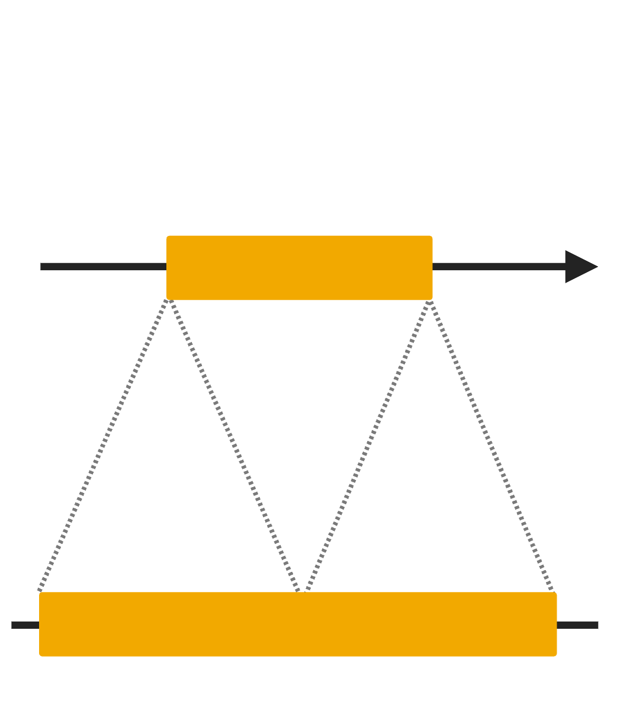{style="width: 250px;"}

:::


::::

:::

## [Limitations]{style="color: var(--lab-yellow)"} {auto-animate="true"}

::: {.overview-text-box data-id="future" style="background: #f2ce82; position: absolute; top: 13%; left: 0%; width: 1050px; padding: 0.5em; z-index: 1;"}

:::: {.columns style="font-size: 27pt;"}

::: {.column width="33%" .fragment fragment-index=1 .fade-in-then-semi-out}
**Sample Population**

::: {style="width: 350px;"}

:::

:::

:::: {.column width="33%" .fragment fragment-index=2 .fade-in}
::: {.fragment fragment-index=4 .semi-fade-out}

**Cross-Sectional Data**

::: {.fragment fragment-index=3 .fade-out style="position: absolute; top: 22%; left: 40%;"}
{style="width: 200px;"}
:::

::: {.fragment fragment-index=3 .fade-in style="position: absolute; top: 30%; left: 33%;"}
{style="width: 400px;"}
:::

:::
::::

::: {.column width="33%" .fragment fragment-index=4 .fade-in-then-semi-out}
**Cognitive Phenotype**


{style="width: 250px;"}

:::


::::

:::

::: {data-id="edi-sml" style="position: absolute; top: -100%; left: 60%; width: 75px; opacity: 0.5;"}

:::

## [EDIAJ Considerations]{style="color: #ef4040;"} {auto-animate="true"}

::: {data-id="edi-sml" style="position: absolute; top: -4%; left: 60%; width: 75px;"}

:::

::: {.overview-text-box data-id="future" style="background: #fcb0b0; position: absolute; top: 13%; left: 0%; width: 1050px; padding: 0.5em; z-index: 1;"}

:::: {.columns style="font-size: 37pt;"}

::: {.column width="50%" .fragment fragment-index=1 .fade-in-then-semi-out}
**Data Availability**

{style="width: 250px;"}

:::

::: {.column width="50%" .fragment fragment-index=2 .fade-in}

**Ancestry-aware Tools**

{style="width: 200px;"}
:::


::::

:::

## Final Thoughts {auto-animate="true"}

::: {.overview-text-box data-id="future" style="background: gray; position: absolute; top: 13%; left: 0%; width: 1050px; padding: 0.5em; z-index: 1;"}

:::: {.columns style="font-size: 27pt; color: white;"}

::: {.column width="33%" .fragment fragment-index=1 .fade-in-then-semi-out}
[**Genetics as a Tool**]{style="text-decoration: underline;"}

Genetic methods can help us understand causation vs. correlation

:::

:::: {.column width="33%" .fragment fragment-index=2 .fade-in-then-semi-out}

[**Phenotype**]{style="text-decoration: underline;"}

Comprehensive phenotypes matter to the power and applicability of a study

::::

::: {.column width="33%" .fragment fragment-index=4 .fade-in-then-semi-out}
[**Clinical Application**]{style="text-decoration: underline;"}


Improved prevention strategies and disease prediction

:::


::::

:::

## [Acknowledgements]{style="font-size: 35pt;"} {auto-animate="true"}

::: {style="position: absolute; top: 6%; left: 5%; width: 950px;"}
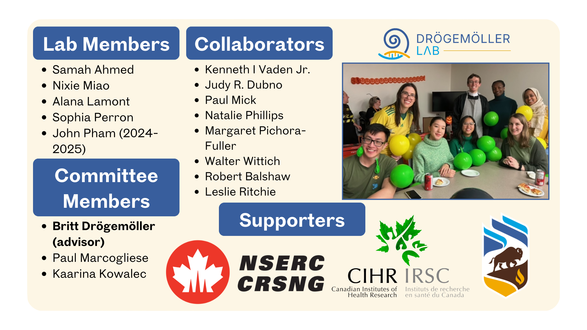
:::

## Supp. 1 - ARHL {data-name="Supplementary"}
### Age-Related Hearing Loss {style="color: gray;"}

::: {.fragment fragment-index='1' .fade-in-then-semi-out}
Symptoms
:::

::: {.fragment fragment-index='2' .fade-in-then-semi-out}
Demographics
:::

::: {.fragment fragment-index='3' .fade-in}
Potential Pathologies
:::

::: {.fragment .fade-in-then-out fragment-index=1 style="position: absolute; top: 50px; left: 450px; width: 525px;"}
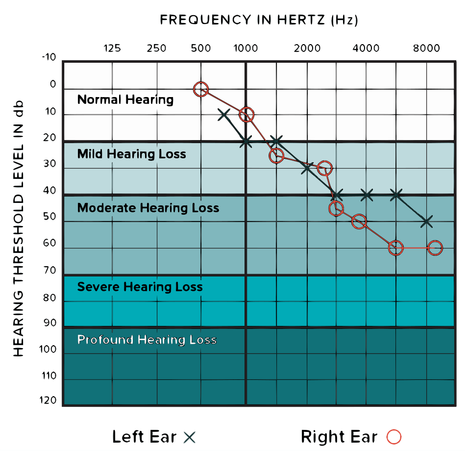
:::

::: {.fragment fragment-index='2' .fade-in-then-out style="position: absolute; left: 150px; top: 215px; width: 325px; height: auto;"}
{auto-animate-id="ear1"}
:::

::: {.fragment fragment-index='2' .fade-in-then-out style="position: absolute; left: 475px; top: 220px; width: 275px; height: auto;"}
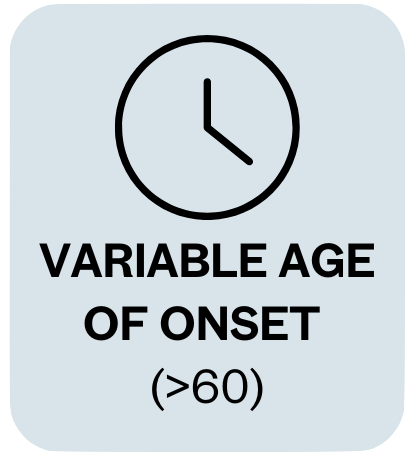{auto-animate-id="ear2"}
:::

::: {.fragment fragment-index='2' .fade-in-then-out style="position: absolute; left: 750px; top: 215px; width: 425px; height: auto;"}
{auto-animate-id="ear3"}
:::


::: {.fragment .fade-in fragment-index=3 .dementia-text-box style="text-align: center; background: var(--lab-yellow); color: white; position: absolute; top: 85px; left: 550px; width: 500px; padding: 0.1em;"}
ENVIRONMENTAL FACTORS

(noise, drug toxicity)
:::


::: {.fragment .fade-in fragment-index=4 .dementia-text-box style="text-align: center;  background: var(--lab-yellow); color: white; position: absolute; top: 245px; left: 550px; width: 500px; padding: 0.1em;"}
OXIDATIVE STRESS
:::

::: {.fragment .fade-in fragment-index=5 .dementia-text-box style="text-align: center; background: var(--lab-yellow); color: white; position: absolute; top: 345px; left: 550px; width: 500px; padding: 0.1em;"}
CHRONIC INFLAMMATION
:::

::: {.fragment .fade-in fragment-index=6 .dementia-text-box style="text-align: center; background: var(--lab-yellow); color: white; position: absolute; top: 445px; left: 550px; width: 500px; padding: 0.1em;"}
GENETICS
:::


## Supp. 2 - Initial Analysis

::: {style="position: absolute; top: 150px;"}
``` {=html}

<style type="text/css">
.tg  {border-collapse:collapse;border-spacing:0;margin:0px auto;}
.tg td{border-color:black;border-style:solid;border-width:1px;font-family:Arial, sans-serif;font-size:30px;
  overflow:hidden;padding:10px 5px;word-break:normal;}
.tg th{border-color:black;border-style:solid;border-width:1px;font-family:Arial, sans-serif;font-size:30px !important;
  font-weight:normal;overflow:hidden;padding:10px 5px;word-break:normal;}
.tg .tg-1wig{font-weight:bold;text-align:left;vertical-align:top; font-size:30px !important;}
.tg .tg-0lax{text-align:left;vertical-align:top; font-size:30px !important;}
</style>
<table class="tg"><thead>
  <tr>
    <th class="tg-0lax"><span style="font-weight:bold">ARHL Subtype</span></th>
    <th class="tg-1wig"><span style="font-weight:bold">Coefficient</span>(SE)</th>
    <th class="tg-0lax"><span style="font-weight:bold">OR (95% CI)</span></th>
    <th class="tg-0lax"><span style="font-weight:bold">P-value</span></th>
  </tr></thead>
<tbody>
  <tr>
    <td class="tg-0lax">Metabolic ARHL</td>
    <td class="tg-0lax">0.017 (0.003)</td>
    <td class="tg-0lax">1.016 (1.011,1.022)</td>
    <td class="tg-0lax" style="background:#c3f78c;"><span style="font-weight:bold;">3E-9</span></td>
  </tr>
  <tr>
    <td class="tg-0lax">Sensory ARHL</td>
    <td class="tg-0lax">-0.003 (0.004)</td>
    <td class="tg-0lax">0.99 (0.988,1.004)</td>
    <td class="tg-0lax">0.35</td>
  </tr>
</tbody>

  <tfoot>
    <tr>
      <td colspan="4" style="text-align:left; padding-top: 10px; font-size: 14pt">
        <strong>Acronyms:</strong> <strong>ARHL</strong> = Age-related Hearing Loss; <strong>SE</strong> = Standard Error; <strong>OR</strong> = Odds Ratio; <strong>CI</strong> = Confidence Interval.
      </td>
    </tr>
</tfoot>

</table>
  
```
:::

## Supp. 3 - Met. HL Gene Information

## Supp. 4 - Other CLSA data

## Supp. 5 - Genotype QC, Imputation Details

## Supp. 6 - Initial Analysis

## Image sources {.scrollable}

::: {style="font-size: 25pt;"}

- source 1
- source 2
- 
:::